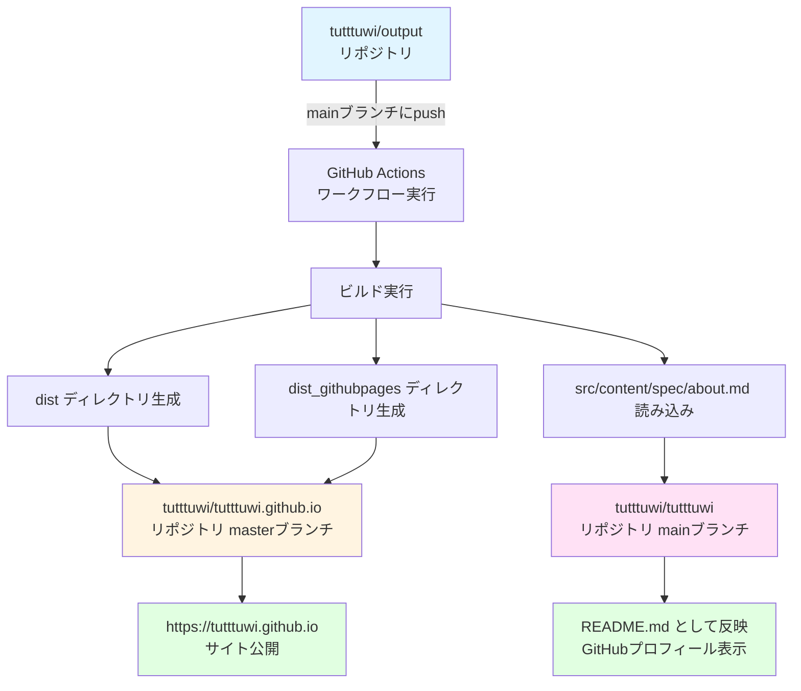

# Portfolio

## デプロイ方法

- [アウトプット用リポジトリ](https://github.com/tutttuwi/output) に定義したワークフローでこのリポジトリを管理しています。

## デプロイフロー

## リポジトリ間の関係

- **tutttuwi/output**: ソースコードリポジトリ（このリポジトリ）
  - 更新内容をmainブランチにpushすると自動デプロイが開始されます
  
- **tutttuwi/tutttuwi.github.io**: GitHub Pages公開用リポジトリ
  - `dist`と`dist_githubpages`の内容が自動的にデプロイされます
  - `https://tutttuwi.github.io`でサイトが公開されます
  
- **tutttuwi/tutttuwi**: GitHubプロフィール表示用リポジトリ
  - `src/content/spec/about.md`の内容が`README.md`として自動更新されます
  - GitHubプロフィールページに表示されます
