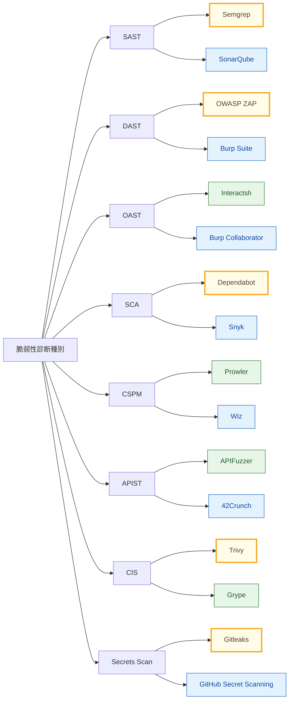

## 概要

脆弱性診断ツールは種類が多く、選定の時点で迷いやすいです。
この記事では、まず全体像をつかみ、そのあとに実運用で使える比較と導入ステップまで一気に整理します。

## 想定読者とこの記事のゴール

本記事は、開発チームまたはSRE/セキュリティ担当として「脆弱性診断ツールをどう選び、どう運用に乗せるか」を短時間で判断したい読者を想定しています。

ゴールは次の3点です。

- 種別ごとの役割を誤解なく把握する
- 無料/有料を含む現実的な選択肢を比較する
- 明日から動ける導入ステップを決める

## まず押さえる用語整理

似た言葉が多いため、最初にざっくり整理しておきます。

- `SAST`: ソースコードを静的に解析し、実装上の問題を早期検出
- `DAST`: 稼働中アプリにリクエストを送り、外部から見える脆弱性を検出
- `OAST`: 外部コールバックを使い、Blind系（SSRF/XXE等）の検出を補完
- `SCA`: OSS依存パッケージの脆弱性・ライセンスを把握
- `CSPM/KSPM/IaC Scan`: クラウド設定やIaCのミスコンフィグを検出

実務上は「診断（検出）」と「防御（RASP/CNAPP/CWPPなど）」を分けて考えると、導入時の判断がしやすくなります。

## まず全体像（種別一覧）

最初に、脆弱性診断の種別を一枚で把握します。ここを基準に、この後の比較表や導入パターンを見ていくと理解しやすいです。

| ツール種別                             | 略称＊SASTなど | 診断対象・目的                                                                | 代表ツール                                         | その他備考                               |
| -------------------------------------- | -------------- | ----------------------------------------------------------------------------- | -------------------------------------------------- | ---------------------------------------- |
| サーバー・OS・インフラ脆弱性診断       | VMS / VM       | OS・ミドルウェア・ネットワーク機器の既知脆弱性検出                            | Nessus, Qualys VMDR, OpenVAS                       | 定期スキャンとパッチ管理の連携が重要     |
| コンテナ・イメージスキャン             | CIS            | コンテナイメージ内のOS/ライブラリ脆弱性検出                                   | Trivy, Grype, Clair                                | CI/CD組み込みでシフトレフトしやすい      |
| Webアプリケーション動的診断            | DAST           | 稼働中Webアプリへの疑似攻撃で脆弱性検出                                       | OWASP ZAP, Burp Suite, Invicti                     | 実行環境依存。認証付きテスト設計が鍵     |
| Out-of-Bandアプリケーション診断        | OAST           | 外部コールバックを利用し、Blind系脆弱性（SSRF/XXE/Command Injection等）を検出 | Burp Collaborator, Interactsh                      | DASTやAPI診断と併用して検出率を高める    |
| ソースコード静的解析                   | SAST           | コード上の脆弱実装・危険パターン検出                                          | SonarQube, Checkmarx, Semgrep                      | 早期検出に有効。誤検知チューニングが必要 |
| ソフトウェア・コンポジション解析       | SCA            | OSS依存関係の脆弱性・ライセンスリスク把握                                     | Snyk, Dependabot, OWASP Dependency-Check           | SBOM運用と相性が良い                     |
| クラウド設定ポスチャ管理               | CSPM           | クラウド設定ミス・過剰権限・準拠違反の検出                                    | Prisma Cloud, Wiz, Orca Security                   | マルチクラウド統制に有効                 |
| インタラクティブ・アプリケーション診断 | IAST           | 実行時のアプリ内部計測で脆弱性を高精度検出                                    | Contrast Security, Seeker                          | DAST/SASTの中間的アプローチ              |
| モバイルアプリ診断                     | MAST           | モバイルアプリの静的/動的/逆コンパイル診断                                    | MobSF, QARK, NowSecure                             | 端末側保護や証明書ピンニング評価も対象   |
| APIセキュリティ診断                    | APIST          | API仕様・認可不備・ビジネスロジック欠陥検出                                   | 42Crunch, Salt Security, Burp Suite API Scan       | OpenAPI連携で網羅性向上                  |
| 外部アタックサーフェス管理             | EASM           | 公開資産の棚卸し・露出リスク・設定不備の検出                                  | Censys, Shodan, Randori                            | Shadow ITの可視化に有効                  |
| 実行時アプリ自己防御                   | RASP           | 実行中アプリを監視し攻撃を検知・防御                                          | Contrast Protect, Imperva RASP                     | 防御寄り技術。診断と併用が一般的         |
| クラウドネイティブ統合保護基盤         | CNAPP          | CSPM/CWPP/CIEM等を統合しクラウド全体を管理                                    | Prisma Cloud, Wiz, Lacework                        | 機能重複があるため導入時の整理が必要     |
| クラウドワークロード保護               | CWPP           | VM/コンテナ/Kubernetes実行基盤の保護・検知                                    | Aqua Security, Sysdig Secure, Prisma Cloud Compute | ランタイム保護中心                       |
| Kubernetes設定ポスチャ管理             | KSPM           | Kubernetesクラスタ設定不備・権限過多の検出                                    | Kubescape, Checkov, kube-bench                     | Kubernetes特化。CSPMの補完として有効     |
| Infrastructure as Code診断             | IaC Scan       | Terraform/CloudFormation等の設定不備を事前検出                                | Checkov, tfsec, Terrascan                          | デプロイ前検出で手戻り削減               |
| シークレット検出                       | Secrets Scan   | ソース/履歴内のAPIキー・資格情報漏えい検出                                    | Gitleaks, TruffleHog, GitHub Secret Scanning       | インシデント予防の即効性が高い           |

## ツール選定マップ（Mermaid）

次に、よく使う種別と代表ツールの関係をマップで俯瞰します。無料/有料/推奨を色で見分けられるようにしています。



- 色の意味: 緑=無料中心、青=有料中心、黄枠=推奨（導入しやすさ/実績ベース）

## 有料・無料と推奨の一覧（実務向け）

マップで全体感をつかんだあと、実際の選定に使えるように有料/無料と推奨候補を表で整理します。

| ツール種別                             | 略称         | 無料候補                           | 有料候補                             | 推奨（まず使う候補）           | その他備考                         |
| -------------------------------------- | ------------ | ---------------------------------- | ------------------------------------ | ------------------------------ | ---------------------------------- |
| サーバー・OS・インフラ脆弱性診断       | VMS / VM     | OpenVAS                            | Nessus, Qualys VMDR                  | Nessus（商用）/ OpenVAS（OSS） | エージェント運用の有無を先に決める |
| コンテナ・イメージスキャン             | CIS          | Trivy, Grype                       | Prisma Cloud Compute, Snyk Container | Trivy                          | CIへの組込みが容易                 |
| Webアプリケーション動的診断            | DAST         | OWASP ZAP                          | Burp Suite Pro, Invicti              | ZAP + Burp Suite（併用）       | 自動と手動の併用が有効             |
| Out-of-Bandアプリケーション診断        | OAST         | Interactsh                         | Burp Collaborator                    | Interactsh（OSS）              | Blind系検出でDAST補完              |
| ソースコード静的解析                   | SAST         | Semgrep CE                         | Checkmarx, SonarQube Server          | Semgrep CE                     | ルール調整で誤検知抑制             |
| ソフトウェア・コンポジション解析       | SCA          | OWASP Dependency-Check, Dependabot | Snyk, Mend                           | Dependabot + Dependency-Check  | SBOM連携しやすい                   |
| クラウド設定ポスチャ管理               | CSPM         | Prowler, ScoutSuite                | Wiz, Prisma Cloud, Orca              | Wiz（商用）/ Prowler（OSS）    | マルチクラウド対応を要確認         |
| インタラクティブ・アプリケーション診断 | IAST         | （選択肢少）                       | Contrast, Seeker                     | Contrast                       | APM連携や性能影響を確認            |
| モバイルアプリ診断                     | MAST         | MobSF                              | NowSecure                            | MobSF                          | まずは静的診断から開始             |
| APIセキュリティ診断                    | APIST        | OWASP ZAP API Scan, APIFuzzer      | 42Crunch, Salt Security              | ZAP API Scan                   | OpenAPI定義の整備が前提            |
| 外部アタックサーフェス管理             | EASM         | Shodan（限定無料）, Amass          | Censys, Randori                      | Censys（商用）/ Amass（OSS）   | 資産棚卸しプロセスとセット運用     |
| 実行時アプリ自己防御                   | RASP         | （選択肢少）                       | Contrast Protect, Imperva RASP       | Contrast Protect               | 防御系で運用チーム連携が必要       |
| クラウドネイティブ統合保護基盤         | CNAPP        | （実質なし）                       | Wiz, Prisma Cloud, Lacework          | Wiz                            | 単一製品へ寄せると運用しやすい     |
| クラウドワークロード保護               | CWPP         | Falco（検知寄り）                  | Aqua, Sysdig Secure                  | Sysdig Secure                  | ランタイム監視設計が重要           |
| Kubernetes設定ポスチャ管理             | KSPM         | Kubescape, kube-bench              | Prisma Cloud, Wiz                    | Kubescape                      | Admission制御との併用推奨          |
| Infrastructure as Code診断             | IaC Scan     | Checkov, tfsec, Terrascan          | Snyk IaC                             | Checkov                        | PR時の自動チェック推奨             |
| シークレット検出                       | Secrets Scan | Gitleaks, TruffleHog               | GitHub Advanced Security             | Gitleaks                       | pre-commit導入が効果的             |

## ツール選定の判断軸

製品比較は機能の多さだけでなく、運用に乗るかどうかで評価するのが重要です。最低限、以下の軸で比較することを推奨します。

| 判断軸 | 見るポイント |
| --- | --- |
| 検出カバレッジ | 想定脅威（Web/API/クラウド/依存関係）をどこまでカバーできるか |
| 精度 | 誤検知/見逃しのバランス、チューニング容易性 |
| 開発体験 | CI/CD連携、PRコメント連携、実行時間 |
| 運用コスト | 初期設定、ルール整備、日次トリアージ負荷 |
| 組織適合 | 監査要件、マルチクラウド、責任分界との整合 |

## 組織規模別の導入パターン

### 1. 小規模チーム（まずは低コストで開始）

- `Semgrep`（SAST）
- `Trivy`（コンテナ/CIS）
- `Gitleaks`（Secrets）
- `Dependabot`（SCA）
- 必要に応じて `OWASP ZAP`（DAST）

まずは「PRで検出し、重大項目だけブロック」を目標にします。

### 2. 中規模チーム（OSS + 商用のハイブリッド）

- OSSで日常スキャン（Semgrep/Trivy/Gitleaks）
- 商用で可視化や高度分析（Burp Suite Pro, Wiz, Snykなど）
- DAST + OAST（ZAP + Interactsh/Burp Collaborator）を併用

検出の幅と運用効率のバランスを取りやすい構成です。

### 3. 大規模組織（統合基盤でガバナンス強化）

- `CNAPP` を中核に `CSPM/CWPP/KSPM` を統合
- 開発側に `SAST/SCA/Secrets` を標準組込み
- 監査向けレポートとSLA運用をセットで定義

「全体可視化」と「現場の改善サイクル」を分断しないことが成功の鍵です。

## CI/CDへの最小実装例（GitHub Actions）

最初の一歩として、PR時に `SAST + SCA + Secrets + Container` を実行する構成が現実的です。

```yaml
name: security-minimum
on:
  pull_request:
  push:
    branches: [main]

jobs:
  security-scan:
    runs-on: ubuntu-latest
    steps:
      - uses: actions/checkout@v4

      - name: Semgrep (SAST)
        uses: returntocorp/semgrep-action@v1

      - name: Trivy (Container/FS)
        uses: aquasecurity/trivy-action@0.24.0
        with:
          scan-type: "fs"
          scan-ref: "."
          severity: "CRITICAL,HIGH"

      - name: Gitleaks (Secrets)
        uses: gitleaks/gitleaks-action@v2

      - name: Dependency Check (SCA)
        uses: dependency-check/Dependency-Check_Action@main
        with:
          project: "sample"
          path: "."
          format: "HTML"
```

ポイントは、最初から完璧を目指さず、重大度で閾値を決めて段階的に厳格化することです。

## 運用ルール（導入後に効く項目）

ツール導入よりも、トリアージ運用の設計が成果を左右します。最低限、以下を決めておくと運用が安定します。

- 重大度ごとの対応期限（例: Criticalは48時間以内）
- 誰が一次トリアージするか（開発/セキュリティの責任分界）
- 誤検知のクローズ基準と再発防止の記録方法
- 例外承認フロー（期限付き、承認者明記）
- 月次での再発傾向レビュー

## よくある失敗と回避策

- ツールを増やしすぎて誰も見なくなる  
  -> 最初は4種類程度に絞る（SAST/SCA/Secrets/Container）
- 検出はするが直らない  
  -> SLAと担当を定義し、未対応を可視化する
- 誤検知が多く開発体験を壊す  
  -> ルールを棚卸しし、ノイズの高い検知は調整する
- 本番運用前にCI時間が肥大化する  
  -> PR時と夜間バッチでジョブを分割する

## 30/60/90日ロードマップ

| 期間 | 目標 | 実施内容 |
| --- | --- | --- |
| 30日 | 可視化開始 | Semgrep/Trivy/Gitleaks/DependabotをCIへ導入し、重大項目を把握 |
| 60日 | 運用定着 | トリアージ手順、SLA、例外承認フローを文書化して運用 |
| 90日 | 統制強化 | DAST/OASTやCSPMを追加し、クラウド/アプリ横断で継続改善 |

## 参考フレームワーク

判断根拠を揃えるため、以下のフレームワークを参照すると実務で説明しやすくなります。

- OWASP ASVS
- OWASP SAMM
- NIST SSDF

## まとめ

脆弱性診断ツールの導入は「どの製品を入れるか」だけでなく、「どの順で、誰が、どう回すか」で成果が大きく変わります。
まずは小さく始めて、`SAST/SCA/Secrets/Container` を確実に運用し、次に `DAST/OAST` や `CSPM` へ広げる進め方が現実的です。
