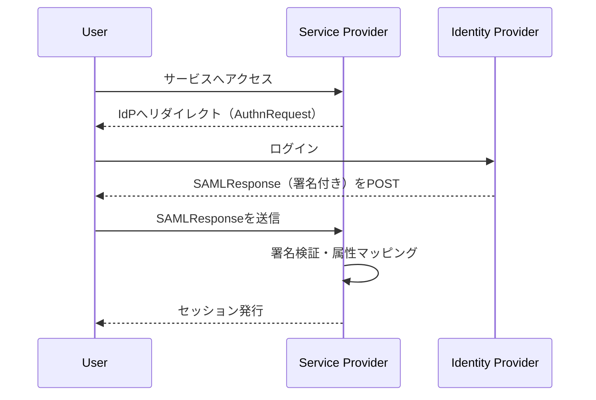
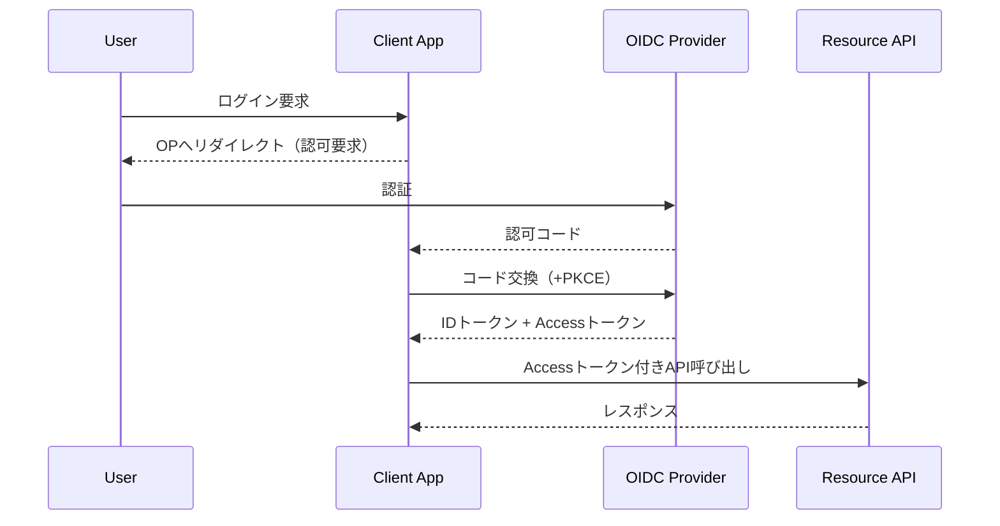
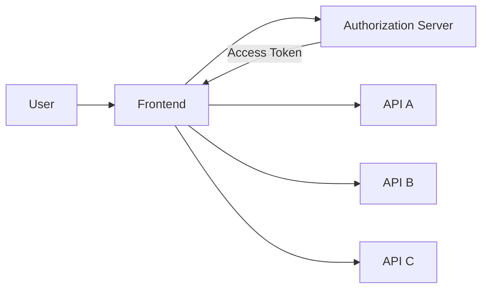
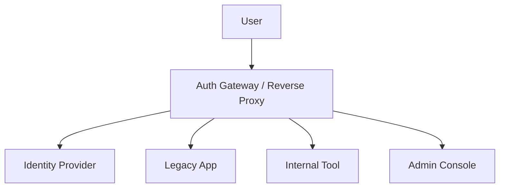

## 概要

SSO（Single Sign-On）は、1回の認証で複数システムにアクセスできる仕組みです。  
「SSO連携」と一口に言っても、利用するプロトコルやトークンの扱いによって実装パターンが大きく変わります。

この記事では、実務でよく使われるSSO連携の実装種別を整理し、各方式の動きと実装観点を図付きでまとめます。

## SSO連携の実装種別

代表的な実装種別は次の4つです。

1. **SAML 2.0ベースSSO**
2. **OpenID Connect（OIDC）ベースSSO**
3. **OAuth 2.0（認可委譲）を中心にした疑似SSO**
4. **ゲートウェイ／リバースプロキシ型SSO**

> 補足: 近年の新規開発ではOIDCが中心ですが、企業システムではSAMLが現役のケースも多く、ハイブリッド運用も一般的です。

---

## 各実装種別ごとの具体的な内容

### 1) SAML 2.0ベースSSO

#### SAMLの方式概要

- ブラウザリダイレクトとXMLアサーションを使って認証結果を連携
- `IdP（Identity Provider）` が認証し、`SP（Service Provider）` が受け入れる
- 企業内業務システムやSaaS連携で現在も広く利用

#### SAML実装のポイント

- **メタデータ交換**: IdP/SP間で証明書・エンドポイントを事前共有
- **署名検証**: SAMLResponseの署名検証は必須
- **属性マッピング**: `NameID` や属性をアプリのユーザー情報へ対応付け
- **セッション管理**: SP側セッションの有効期限と再認証条件を設計

#### SAMLが向いているケース

- 既存の企業基盤（ADFS, Shibboleth など）との連携
- 既存SaaS連携がSAML中心の組織

---

### 2) OpenID Connect（OIDC）ベースSSO

#### OIDCの方式概要

- OAuth 2.0を拡張し、`IDトークン（JWT）` で認証情報を表現
- Web/SPA/モバイルなどモダンなアプリ実装と相性が良い
- `Authorization Code Flow + PKCE` が現在の推奨

#### OIDC実装のポイント

- **フロー選定**: サーバーサイド/SPAで適切なフローを選ぶ
- **トークン検証**: 署名、`iss`、`aud`、`exp` の検証を徹底
- **PKCE対応**: 公開クライアント（SPA/モバイル）では必須
- **リフレッシュ戦略**: セキュアな保管と失効設計が重要

#### OIDCが向いているケース

- 新規開発のWebアプリ、モバイルアプリ、API中心アーキテクチャ
- Keycloak、Auth0、Entra IDなどモダンIdP利用時

---

### 3) OAuth 2.0中心の疑似SSO

#### OAuth中心方式の概要

- OAuthは本来「認可」の仕様であり、認証そのものの標準はOIDCが担う
- ただし実務では「同じ認可サーバーのトークンで複数APIを呼ぶ」ことで、体感的なSSOを実現するケースがある

#### OAuth中心方式の実装ポイント

- **認証と認可の分離理解**: ログイン要件はOIDC併用で満たす
- **スコープ設計**: API単位の権限境界を明確化
- **トークン寿命**: 短命化と更新制御で漏えいリスクを低減

#### OAuth中心方式の注意点

- OAuth単独では「ユーザーが誰か」を標準化して表現しづらい
- 「SSOを実装したつもり」になる落とし穴があるため、要件定義で認証責務を明確にする

---

### 4) ゲートウェイ／リバースプロキシ型SSO

#### ゲートウェイ型の方式概要

- アプリの手前に認証ゲートウェイを置き、認証を共通化する方式
- 各アプリはゲートウェイから渡されるヘッダやクレームを信頼して利用
- レガシーアプリを短期間でSSO配下に入れたい時に有効

#### ゲートウェイ型の実装ポイント

- **信頼境界の明確化**: ヘッダ偽装防止（内部NW限定、mTLS等）
- **アプリ改修最小化**: 既存アプリ側は最小限のユーザー受け渡し対応
- **監査ログ**: ゲートウェイで統一的に認証/アクセスログを取得

#### ゲートウェイ型が向いているケース

- レガシー資産が多く、アプリ個別改修コストを抑えたい
- 認証統制を入口で一元管理したい

---

## 実装選定の観点（簡易比較）

| 観点                   | SAML              | OIDC                 | OAuth中心          | ゲートウェイ型 |
| ---------------------- | ----------------- | -------------------- | ------------------ | -------------- |
| 主な用途               | 企業連携/既存SaaS | 新規Web/SPA/モバイル | API認可中心        | レガシー統合   |
| 実装難易度             | 中                | 中                   | 中                 | 中〜高         |
| モダン開発との相性     | 低〜中            | 高                   | 中                 | 中             |
| 認証標準としての明確さ | 高                | 高                   | 低（単独では不足） | 構成依存       |

## まとめ

SSO連携は「どのプロトコルを使うか」だけでなく、**認証責務をどこで担保するか**を決める設計です。  
新規開発ではOIDCが第一候補になりやすく、既存環境ではSAMLやゲートウェイ型との併用が現実的です。

最終的には、次の3点で選ぶと失敗しにくくなります。

- 利用中のIdP・既存資産との親和性
- 対象アプリ（Web/SPA/モバイル/レガシー）の実装特性
- 監査・運用（失効、ログ、障害時切り戻し）まで含めた運用設計
