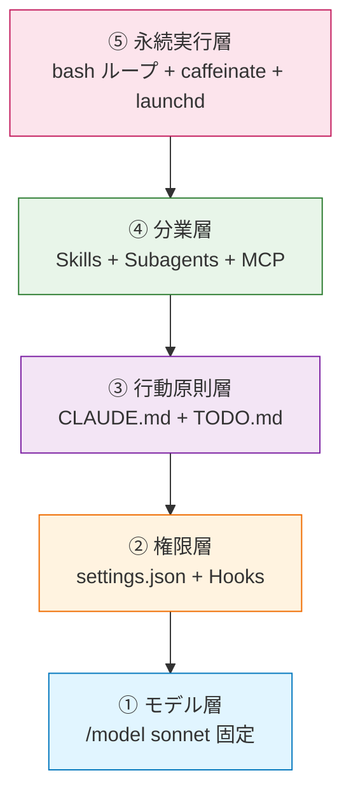
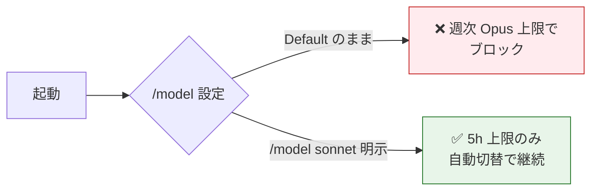
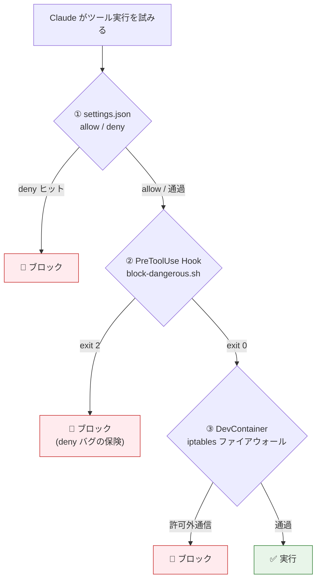
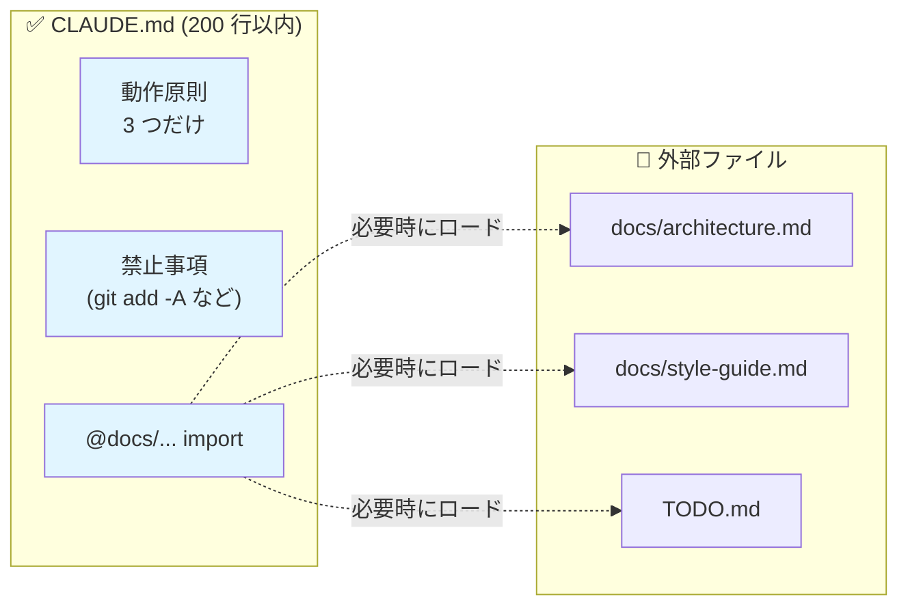
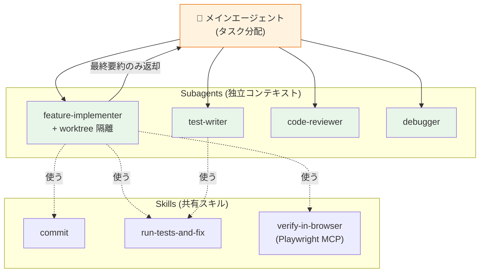
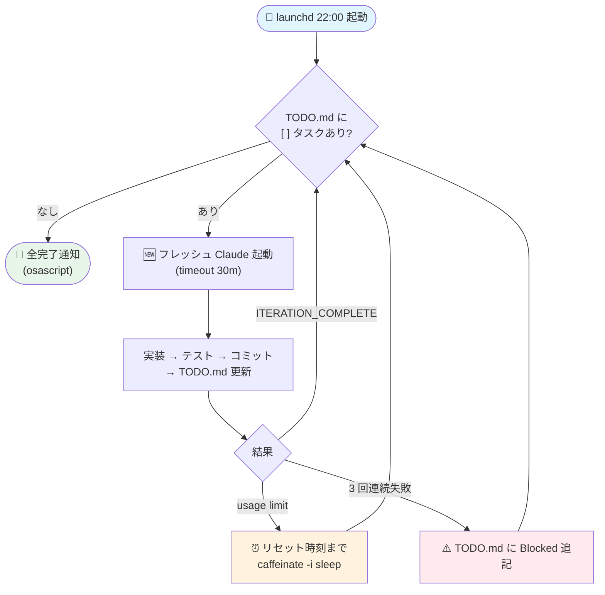
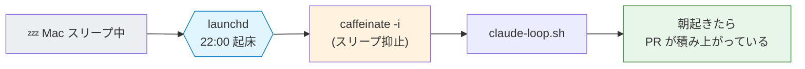
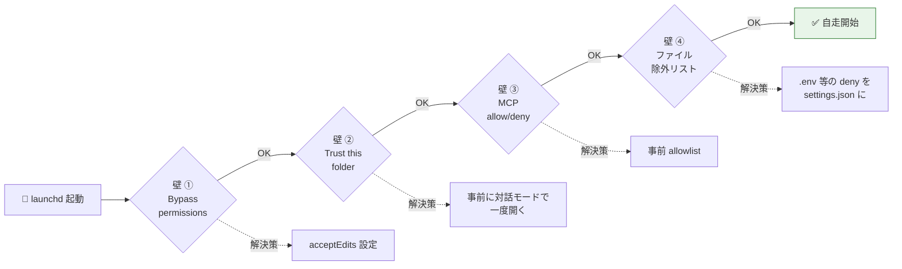

## この記事のゴール

「機能要件を 1 行書けば、寝ている間に PR が出来上がっている」という状態を、**Pro プラン($20/月)でも実現する**ための最小構成のベストプラクティスをまとめます。

ここでは「**今日から導入できる実装手順**」だけを順序立てて並べていきます。

---

## 全体像:5 層構成で考える

無人運用は、以下の 5 層をきれいに積み上げることで安定します。



| 層 | 役割 | 主なツール |
|----|------|-----------|
| ① モデル | 安定稼働 | `/model sonnet` 固定 |
| ② 権限 | 暴走防止 | `settings.json` の deny + Hooks |
| ③ 行動原則 | 動作優先・止めない | `CLAUDE.md` + `TODO.md` |
| ④ 分業 | コンテキスト圧迫回避 | Skills + Subagents + MCP |
| ⑤ 永続実行 | 24 時間化 | bash ループ + `caffeinate` + `launchd` |

すべて `.claude/` 配下と `~/Library/LaunchAgents/` だけで完結します。

---

## ベストプラクティス 1:モデルは `/model sonnet` を明示する

- Pro プランでは Opus はそもそも使えませんが、**Default のままだと週次 Opus 上限に当たってブロックされます**。
- 起動直後に必ず `/model sonnet` を実行しましょう。5 時間制限なら自動切替が効くため止まりません。
- 残量は `npx ccusage@latest blocks --live` で常時確認できます。`statusLine` に登録するとプロンプト下に常駐表示されます。
- **真犯人は Cache Read** です。月初に `ccusage daily --breakdown` で内訳を確認する習慣をつけてください。



---

## ベストプラクティス 2:権限は「三層防衛」で固める

`settings.json` の deny には 2025〜2026 年に既知バグが残っているため、**必ず PreToolUse Hook で重ねがけ**しましょう。



### `.claude/settings.json` 最小テンプレ

```json
{
  "permissions": {
    "defaultMode": "acceptEdits",
    "allow": [
      "Bash(npm:*)", "Bash(pnpm:*)", "Bash(git status)", "Bash(git diff *)",
      "Bash(git add *)", "Bash(git commit -m *)", "Bash(gh *)",
      "Read", "Edit", "Write", "Glob", "Grep",
      "mcp__playwright__*", "mcp__github__*", "mcp__context7__*"
    ],
    "ask": ["Bash(git push *)"],
    "deny": [
      "Read(./.env)", "Read(./.env.*)", "Read(**/.aws/**)", "Read(**/.ssh/**)",
      "Bash(rm -rf:*)", "Bash(sudo:*)", "Bash(curl:*)", "Bash(wget:*)"
    ]
  },
  "hooks": {
    "PreToolUse": [{
      "matcher": "Bash",
      "hooks": [{ "type": "command",
        "command": "$CLAUDE_PROJECT_DIR/.claude/hooks/block-dangerous.sh" }]
    }],
    "PostToolUse": [{
      "matcher": "Edit|Write|MultiEdit",
      "hooks": [
        { "type": "command", "command": "npx prettier --write \"$CLAUDE_TOOL_INPUT_FILE_PATH\" 2>/dev/null; true" }
      ]
    }],
    "Stop": [{
      "hooks": [{ "type": "command",
        "command": "afplay /System/Library/Sounds/Glass.aiff & osascript -e 'display notification \"Task done\" with title \"Claude Code\"'" }]
    }]
  }
}
```

### 抑えておきたい原則

- **`defaultMode: acceptEdits`** が無人運用の基本です。`bypassPermissions` は実機では使わないようにしてください。
- **`exit 2` でブロッキング**できるのが Hook の強みです(Unix 慣習と逆なので注意してください)。
- `git push` だけは `ask` に置いて、PR 作成だけは人間が確認する運用が安全です。

---

## ベストプラクティス 3:CLAUDE.md は「200 行以下」「動作ルールだけ」

LLM の指示遵守は 150〜200 個が限界と言われています。`@docs/architecture.md` のように外出しして、本体は **行動原則** に絞りましょう。



### 必須の 3 原則

1. **動作優先・デザイン後回し**:UI は最低限の見た目で先に動かす
2. **解決困難は TODO.md に「⚠️ Blocked」で記録して次へ**:3 回連続失敗したら諦める
3. **完了報告の禁止条件**:failing tests / compile errors が残っていたら完了と言わせない

### コピペテンプレ(抜粋)

```markdown
## 開発フロー
1. `git switch -c feat/<topic>` でブランチ作成
2. 実装 → `npm run typecheck` → `npm test` → Playwright 検証
3. 全グリーンで `git add -p` → Conventional Commits でコミット
4. 機能完了で `gh pr create --fill`

## 解決困難な課題
- 同じテストが 3 回連続失敗 → TODO.md に「⚠️ Blocked」追記して次へ
- 不確実な API は Context7 MCP で確認

## 禁止事項
- `git add -A` 禁止
- `.env*`、`*.pem` のコミット禁止
- `any`、`as`、`@ts-ignore` 禁止
- 既存テストの削除禁止
```

---

## ベストプラクティス 4:Skills と Subagents で分業する



### Skills は 3 つだけ用意

`.claude/skills/<name>/SKILL.md` の YAML frontmatter は **「◯◯と言ったら必ず使え」と押し気味に書く**のが Anthropic 推奨です。

| Skill | 役割 |
|-------|------|
| `commit` | Conventional Commits を自動生成 |
| `run-tests-and-fix` | テスト実行 + 失敗時の修正 |
| `verify-in-browser` | Playwright MCP で UI を実機検証 |

### Subagents は 4 つに絞る

`.claude/agents/<name>.md` に独立コンテキスト・独立権限のエージェントを定義します。**最終要約だけ親に返る**ためメインを汚染しません。

- `feature-implementer`(実装、`isolation: worktree`)
- `test-writer`(テスト作成)
- `code-reviewer`(レビュー)
- `debugger`(デバッグ)

5 個以上に増やすと選択ミスが増えます。**3〜7 個が黄金比**です。

---

## ベストプラクティス 5:MCP は `.mcp.json` ルート直下に置く

`.claude/.mcp.json` だと一部読み込まれない既知不具合があります。**必ずプロジェクトルート**に置いてください。

無人運用に効く 7 点セット:

```json
{
  "mcpServers": {
    "github": {
      "type": "http",
      "url": "https://api.githubcopilot.com/mcp",
      "headers": { "Authorization": "Bearer ${GITHUB_PAT}" }
    },
    "playwright": { "command": "npx", "args": ["@playwright/mcp@latest", "--browser=chromium"] },
    "chrome-devtools": { "command": "npx", "args": ["chrome-devtools-mcp@latest"] },
    "context7": { "command": "npx", "args": ["-y", "@upstash/context7-mcp@latest"] },
    "sequential-thinking": { "command": "npx", "args": ["-y", "@modelcontextprotocol/server-sequential-thinking"] },
    "memory": { "command": "npx", "args": ["-y", "@modelcontextprotocol/server-memory"] }
  }
}
```

> ⚠️ `@modelcontextprotocol/server-github` の npm 版は **2025/4 に deprecated** になりました。GitHub 公式の HTTP 版を使ってください。

---

## ベストプラクティス 6:TODO.md 駆動の無限ループで 24 時間化

「LLM の記憶を信じない、ファイルに状態を書き続ける」という **Ralph Wiggum ループ思想**が核になります。各イテレーションは **フレッシュコンテキスト** で開始し、知識は Git と TODO.md で永続化させます。



### `claude-loop.sh`(macOS / Linux 両対応・最小版)

```bash
#!/usr/bin/env bash
set -uo pipefail
TODO="$(pwd)/TODO.md"; LOG_DIR="$(pwd)/.claude-loop"; mkdir -p "$LOG_DIR"
ITER=0; MAX_ITER="${MAX_ITER:-50}"

while (( ITER < MAX_ITER )); do
  ITER=$((ITER + 1)); LOG="$LOG_DIR/iter_${ITER}.log"

  # 未完了タスクが無ければ終了
  grep -qE '^\s*-\s*\[\s*\]' "$TODO" 2>/dev/null || {
    osascript -e 'display notification "ALL DONE 🎉" with title "Claude Loop"'
    break
  }

  timeout 30m claude -p "TODO.md の最上位 [ ] タスクを実装→テスト→コミット→[x]更新。
完了で 'ITERATION_COMPLETE' を最終行に出力。3 回連続失敗で ⚠️Blocked 追記して次へ。" \
    --permission-mode acceptEdits --output-format text 2>&1 | tee "$LOG"

  # リミット検知 → リセット時刻まで待機
  if grep -qiE "usage limit reached" "$LOG"; then
    reset=$(grep -oE 'reset at [0-9]+(am|pm)' "$LOG" | tail -1 | awk '{print $3}')
    sleep_for=$(( $(date -j -f '%I%p' "$reset" +%s 2>/dev/null || echo 1800) - $(date +%s) + 60 ))
    (( sleep_for < 60 )) && sleep_for=1800
    caffeinate -i sleep "$sleep_for"
  fi
done
```

### tmux で起動する場合

```bash
tmux new-session -d -s claude-loop \
  "caffeinate -i ./claude-loop.sh > .claude-loop/run.log 2>&1"
tmux attach -t claude-loop   # 監視
# Ctrl+b d でデタッチ
```

---

## ベストプラクティス 7:Mac の launchd で完全無人化(cron は使わない)

**cron は寝てる Mac では発火しません**。launchd 一択です。



### `~/Library/LaunchAgents/com.user.claude-loop.plist`

```xml
<?xml version="1.0" encoding="UTF-8"?>
<plist version="1.0"><dict>
  <key>Label</key><string>com.user.claude-loop</string>
  <key>ProgramArguments</key><array>
    <string>/usr/bin/caffeinate</string><string>-i</string>
    <string>/bin/bash</string><string>-lc</string>
    <string>cd /Users/me/projects/myapp && /usr/local/bin/claude-loop.sh</string>
  </array>
  <key>StartCalendarInterval</key>
    <dict><key>Hour</key><integer>22</integer><key>Minute</key><integer>0</integer></dict>
  <key>EnvironmentVariables</key>
    <dict><key>PATH</key><string>/opt/homebrew/bin:/usr/local/bin:/usr/bin:/bin</string></dict>
  <key>StandardOutPath</key><string>/Users/me/.claude-loop/stdout.log</string>
  <key>StandardErrorPath</key><string>/Users/me/.claude-loop/stderr.log</string>
</dict></plist>
```

### 4 つの「壁」を事前に潰しましょう(GMO ペパボの知見)

cron / launchd で自走させるとき、毎回ハマる 4 つのポイントがあります。



| 壁 | 内容 | 解決策 |
|----|------|--------|
| ① Bypass permissions | 権限プロンプトで止まる | `--permission-mode acceptEdits` |
| ② Trust this folder | 初回起動で信頼確認 | 対話モードで一度開く、もしくは `~/.claude.json` の `hasTrustDialogAccepted: true` を直書き |
| ③ MCP の allow/deny | MCP ツールで止まる | 事前に対話モードで一度許可 |
| ④ ファイル除外 | `.env` などへのアクセス | settings.json の deny に明記 |

---

## 推奨ディレクトリ構成

```
~/projects/myapp/
├── CLAUDE.md                  # 200 行以下、行動原則だけ
├── TODO.md                    # [ ] / [x] / ⚠️ Blocked
├── .mcp.json                  # ルート直下が必須
├── .claude/
│   ├── settings.json          # 権限 + Hooks
│   ├── skills/{commit,run-tests-and-fix,verify-in-browser}/SKILL.md
│   ├── agents/{feature-implementer,test-writer,code-reviewer,debugger}.md
│   └── hooks/block-dangerous.sh
└── specs/<feature>/{requirements,design,tasks}.md   # SDD
```

---

## 全体の流れ:要件 1 行から PR まで

```mermaid
sequenceDiagram
    actor User as 👤 あなた
    participant TODO as 📝 TODO.md
    participant Loop as 🔁 claude-loop.sh
    participant Claude as 🧠 Claude (Sonnet)
    participant Sub as 👥 Subagents
    participant GH as 🐙 GitHub

    User->>TODO: 機能要件を 1 行追記
    User->>Loop: launchd 22:00 起動
    loop 各タスク (フレッシュコンテキスト)
        Loop->>Claude: TODO の [ ] タスクを渡す
        Claude->>Sub: feature-implementer に委譲
        Sub->>Sub: 実装 + test-writer + reviewer
        Sub-->>Claude: 完了要約のみ返却
        Claude->>GH: gh pr create --fill
        Claude->>TODO: [x] に更新
    end
    Loop->>User: 🎉 朝起きたら PR が並んでいる
```

---

## チェックリスト:今日やること

- [ ] `/model sonnet` を明示する習慣をつける
- [ ] `ccusage statusline` を `~/.claude/settings.json` に登録する
- [ ] `.claude/settings.json` の deny に `.env` / `rm -rf` / `sudo` を追加する
- [ ] `.claude/hooks/block-dangerous.sh` で deny を二重化する
- [ ] `CLAUDE.md` を 200 行以下に削り、3 原則を明記する
- [ ] `.mcp.json` をルート直下に置き、Playwright + GitHub + Context7 を登録する
- [ ] Skills を `commit` / `run-tests-and-fix` / `verify-in-browser` の 3 つだけ作る
- [ ] Subagents を 4 つに絞る(`isolation: worktree`)
- [ ] `claude-loop.sh` + `caffeinate` で tmux 起動を試す
- [ ] 安定したら launchd plist で 22:00 起動に登録する

---

## まとめ

Pro プランで 24 時間自律稼働させる肝は、派手な機能ではなく **地味な 3 つの徹底** にあります。

1. **権限は三層で固める**(settings の allow/deny + PreToolUse Hook + DevContainer)
2. **行動原則は短く書く**(CLAUDE.md は 200 行、解決困難は次へ)
3. **状態はファイルに書く**(TODO.md + Git で記憶を永続化、コンテキストはフレッシュ)

これに `caffeinate` + `launchd` という 2 つの Mac 固有の小技を足せば、寝ている間に PR が積み上がる環境が完成します。残るボトルネックは Claude ではなく **人間が書く要件の質** だけで、それを `requirements.md` に EARS 記法で書ければ、あとは任せられます。

---

### 関連

- 元の網羅版:[[2026-04-28_Claude Code を Pro プランで 24 時間自律稼働させる完全ガイド.md]]
