## 概要

**機能要件さえ書けば無人で開発が進む究極のセットアップは、5 つの層を組み合わせれば 2026 年 4 月時点で実現可能** です。`--dangerously-skip-permissions` と `--permission-mode acceptEdits`、`.claude/settings.json` の hooks、Subagents と Skills、`.mcp.json` での Playwright/GitHub MCP、そして Mac の `launchd` + `caffeinate` + `tmux` でラップするシェルループ──これだけで「TODO.md 駆動の自律実装ループ」が成立します。

Anthropic は 2025 年 8 月にユーザーの **5% 未満** しか引っかからない週次リミットを導入し、2025 年 9 月の Claude Code 2.0 で Plan Mode と Checkpointing、2025 年 10 月で Skills、2026 年 2 月で Agent Teams、2026 年 4 月で Routines(クラウド定期実行)を順次解放しました。Pro プランでも Sonnet 4.6 を中心に「機能要件 1 行 → spec 生成 → 自律実装 → 自動検証 → PR 作成」までほぼ無人で回すことができ、リミット到達時は Claude が返すリセット時刻を bash でパースして `caffeinate -i sleep` で待機させればよいのです。

本稿では公式ドキュメント・GitHub の主要 OSS・Zenn / Qiita の実装事例を統合し、コピペで動くテンプレート一式を提示します。

### 全体アーキテクチャ

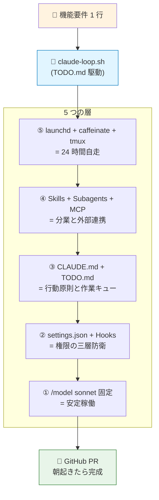

---

## Pro プランの二層リミットと「Sonnet 固定」の鉄則

Anthropic のサブスクリプションは 2025 年 8 月 28 日以降、**5 時間セッション(rolling)と週次リミット** の二層構造に変わりました。プラン別の上限は次の通りです。

| プラン  | 月額 | 5h あたり        | 週次 (Sonnet 換算) |
| ------- | ---- | ---------------- | ------------------ |
| Pro     | $20  | 約 45 メッセージ | 40〜80 時間        |
| Max 5x  | $100 | -                | 140〜280 時間      |
| Max 20x | $200 | -                | 240〜480 時間      |

**Pro でも Claude Code で Opus は利用可能**です。用途によって Sonnet と Opus を使い分けるのが有効ですが、Opus は Sonnet より消費が重くなりやすいため、利用量とコストには注意が必要です。リミット超過時は `extra usage` を有効にすれば、標準 API レートで継続課金できます。

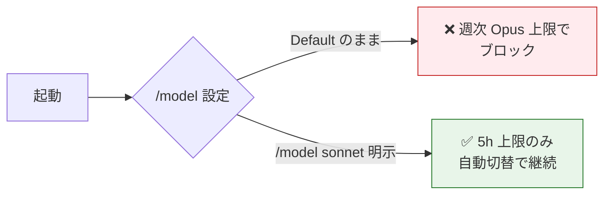

無人運用で最も詰まるのは「`/model` を **Default (recommended)** にしていると、週次の Opus 上限到達時に Sonnet へ自動フォールバックせずブロックされる」点です。**`/model sonnet` を明示** すれば 5 時間制限は自動切替が効きます([Qiita @takezone](https://qiita.com/takezone/items/e6da864ff9e31b0875ca))。リミット到達時に Claude Code が出すメッセージは `Claude usage limit reached. Your limit will reset at 3pm (America/New_York).` または API 直エラーでは `Claude AI usage limit reached|1749924000`(Unix epoch)で、これを bash で正規表現パースします。

残量監視は **`ccusage`**(日本人開発者 ryoppippi 作、`npx ccusage@latest blocks --live`)が標準で、`~/.claude/projects/*.jsonl` を解析して 5 時間ブロックとモデル別コストを表示します。`ccusage statusline` を `~/.claude/settings.json` の `statusLine` に登録すれば、プロンプト下部に常時残量が出ます。Python 製の **claude-monitor**(`uv tool install claude-monitor`、`--plan pro --timezone Asia/Tokyo`)は機械学習でリセット時刻を予測する TUI を提供し、`tmux-claude-live` で tmux ステータスバーへも出せます。日本語 note 記事([@euro0202](https://note.com/euro0202/n/n67db146ef97c))の指摘で重要なのは「消費の大半は output ではなく **Cache Read**」という点で、`ccusage daily --breakdown` で必ず内訳を確認すべきです。

---

## 自動化フラグの全貌と auto モードという新解

Claude Code v2.1+ には自動化用フラグが 50 種類以上ありますが、無人運用で覚えるべきものは限られています。

| フラグ                        | 役割                                                |
| ----------------------------- | --------------------------------------------------- |
| `--print` (`-p`)              | 非対話実行                                          |
| `--continue` (`-c`)           | カレントディレクトリの直近セッション再開            |
| `--resume` (`-r`)             | ID 指定再開                                         |
| `--max-turns`                 | ターン上限                                          |
| `--max-budget-usd`            | API 費用上限                                        |
| `--output-format stream-json` | NDJSON ログ取得                                     |
| `--worktree` (`-w`)           | `.claude/worktrees/<name>/` への隔離 worktree 作成  |
| `--bare`                      | hooks/skills/MCP の自動探索を全スキップして高速起動 |

SDK 連携には `--input-format stream-json` と `--include-hook-events` が便利です。

権限制御の中心は `--permission-mode` で、値は **`default`/`acceptEdits`/`plan`/`auto`/`bypassPermissions`** の 5 つです。Shift+Tab で対話モード中の YOLO / auto-accept 切替に使います。

```mermaid
stateDiagram-v2
    [*] --> default
    default --> acceptEdits: Shift+Tab
    acceptEdits --> plan: Shift+Tab
    plan --> bypassPermissions: Shift+Tab
    bypassPermissions --> default: Shift+Tab
    plan --> auto: Shift+Tab
    auto --> default: Shift+Tab

    note right of acceptEdits
        🟢 無人運用の基本
    end note
    note right of bypassPermissions
        ⚠️ 危険:実機では避ける
    end note
    note right of auto
        🆕 2026/4 導入
        サーバ側で危険検知
    end note
```

**`--dangerously-skip-permissions` は `bypassPermissions` の別名** で、全パーミッションプロンプトをスキップしますが `.git`/`.claude`/`.vscode`/`.idea`/`.husky` への書き込みだけは依然確認します(リポジトリ / フック破壊防止)。Anthropic 公式は「コンテナで使え、実機では使うな」と明記しており、2025 年 10 月の Wolak 事件(Issue #10077)では Claude が `rm -rf /` 相当を実行し WSL2 環境のシステムパスを削除しようとしました。eesel AI 調査では同フラグ利用者の **32% が意図しないファイル変更** を経験、**9% がデータ損失** を経験しています。

2026 年 4 月導入の **`--permission-mode auto`** がこの代替として推奨されています。サーバ側の transcript 分類器(fast filter → chain-of-thought)が危険操作を検知し、3 連続 / 累計 20 の拒否で人間にエスカレーションする仕組みです。auto 進入時は blanket shell access、`python/node/ruby` の wildcard、パッケージマネージャ `run` の always-allow ルールはドロップされる安全設計になっています。

---

## settings.json は「許可リスト + deny + hooks」の三層で固める

`.claude/settings.json`(プロジェクト)と `~/.claude/settings.json`(ユーザー)と `managed-settings.json`(IT 管理)の 3 階層があり、配列フィールドは連結マージ、評価順は **deny → ask → allow → defaultMode** で最初にマッチしたルールが勝ちます。

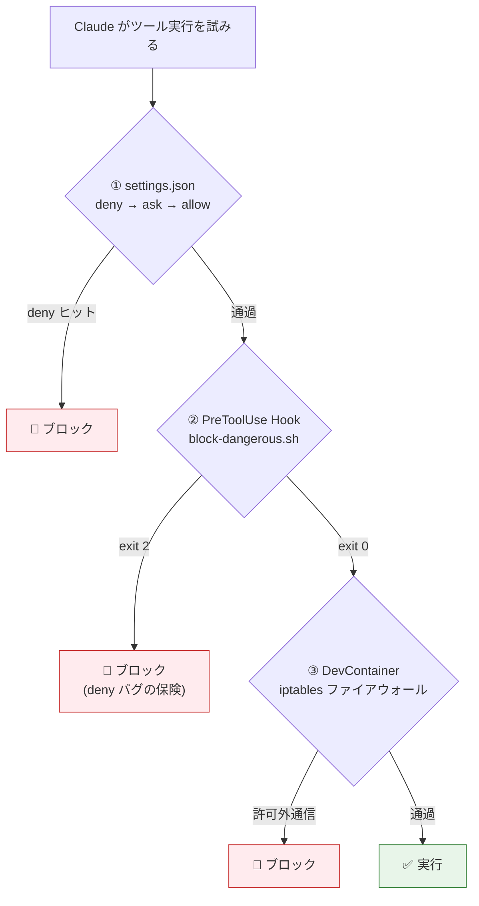

Bash ルールは glob、Read / Edit は gitignore 互換、WebFetch は `domain:` プレフィックスで指定します。ただし **2025〜2026 年の Issue #6699 / #18846 / #15921 / #13340 で `allow`/`deny` が一部効かない既知バグ** が複数 open のため、**重要な制約は必ず PreToolUse hook で重ねがけする** のが業界 consensus です。

無人開発向けの推奨 `settings.json` テンプレートは以下の通りです。`defaultMode` を `acceptEdits` にし、開発で頻発する `npm/pnpm/git/node/python/pytest/make` 系を allow、`git push` だけ ask、機密ファイル(`.env`、`.aws`、`.ssh`、`credentials*`)と破壊コマンド(`rm -rf:*`、`sudo:*`、`curl:*`、`wget:*`)を deny します。

```json
{
  "$schema": "https://json.schemastore.org/claude-code-settings.json",
  "env": {
    "CLAUDE_CODE_DISABLE_NONESSENTIAL_TRAFFIC": "1"
  },
  "permissions": {
    "defaultMode": "acceptEdits",
    "allow": [
      "Bash(npm:*)", "Bash(pnpm:*)", "Bash(yarn:*)",
      "Bash(git status)", "Bash(git diff *)", "Bash(git log *)",
      "Bash(git add *)", "Bash(git commit -m *)", "Bash(git checkout -b *)",
      "Bash(node *)", "Bash(python *)", "Bash(pytest *)", "Bash(make *)",
      "Bash(gh *)",
      "Read", "Edit", "Write", "Glob", "Grep",
      "WebFetch(domain:docs.anthropic.com)",
      "WebFetch(domain:github.com)",
      "mcp__playwright__*", "mcp__github__*", "mcp__context7__*"
    ],
    "ask": ["Bash(git push *)"],
    "deny": [
      "Read(./.env)", "Read(./.env.*)", "Read(**/.aws/**)",
      "Read(**/.ssh/**)", "Read(**/credentials*)",
      "Bash(rm -rf:*)", "Bash(sudo:*)", "Bash(curl:*)", "Bash(wget:*)"
    ]
  },
  "hooks": {
    "PreToolUse": [{
      "matcher": "Bash",
      "hooks": [{ "type": "command",
        "command": "$CLAUDE_PROJECT_DIR/.claude/hooks/block-dangerous.sh" }]
    }],
    "PostToolUse": [{
      "matcher": "Edit|Write|MultiEdit",
      "hooks": [
        { "type": "command", "command": "npx prettier --write \"$CLAUDE_TOOL_INPUT_FILE_PATH\" 2>/dev/null; true" },
        { "type": "command", "command": "npx eslint --fix \"$CLAUDE_TOOL_INPUT_FILE_PATH\" 2>/dev/null; true" }
      ]
    }],
    "Stop": [{
      "hooks": [{ "type": "command",
        "command": "afplay /System/Library/Sounds/Glass.aiff & osascript -e 'display notification \"Task done\" with title \"Claude Code\"'" }]
    }],
    "Notification": [{
      "matcher": "permission_prompt",
      "hooks": [{ "type": "command",
        "command": "afplay /System/Library/Sounds/Basso.aiff & osascript -e 'display notification \"Approval needed\" with title \"Claude Code\"'" }]
    }]
  }
}
```

Hook は **25 種類以上のライフサイクルイベント** を持ち、`PreToolUse`(ツール呼出前、deny 可)、`PostToolUse`(編集後フォーマット)、`Stop`(応答終了、`exit 2` で継続強制可)、`SessionStart`、`UserPromptSubmit`、`SubagentStop`、`PreCompact` などが主役になります。

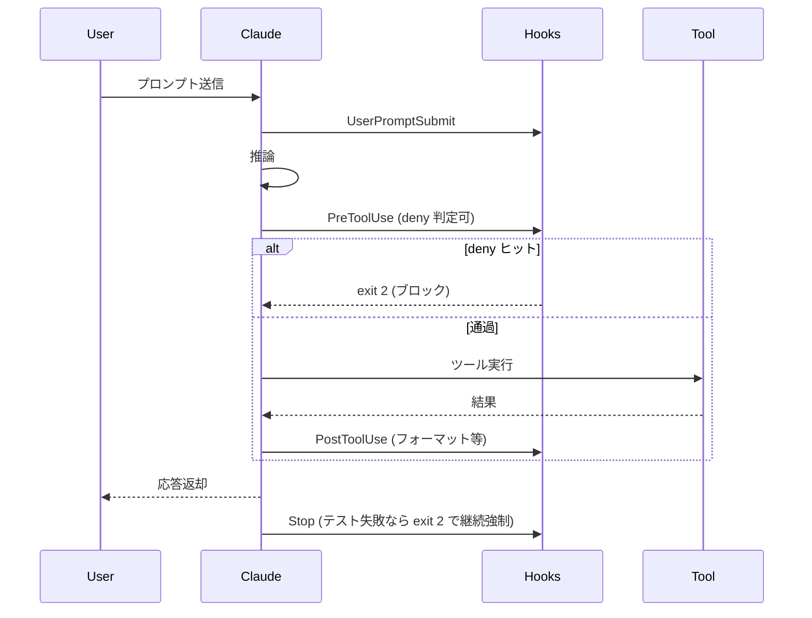

**`exit 0` で成功・`exit 2` でブロッキング / 継続強制** というセマンティクスが Unix 慣習と異なる点に注意してください。`PreToolUse` で `permissionDecision: "deny"` を返せば `bypassPermissions` モードでも止まるため、settings.json の deny バグを補完できます。Stop hook で「テストが通るまで継続」を強制する例は次の通りです。

```bash
#!/usr/bin/env bash
INPUT=$(cat); ACTIVE=$(echo "$INPUT" | jq -r '.stop_hook_active')
[ "$ACTIVE" = "true" ] && exit 0   # 無限ループ防止
if ! npm test > /tmp/test.log 2>&1; then
  echo "Tests failing. Fix and retry. See /tmp/test.log" >&2
  exit 2   # Claude に継続させる
fi
```

---

## CLAUDE.md・Skills・Subagents で「動作優先・解決困難は後回し」を行動原則化

CLAUDE.md は **セッション開始時に自動でコンテキストへロードされる Markdown** で、プロジェクトの「憲法」として働きます。

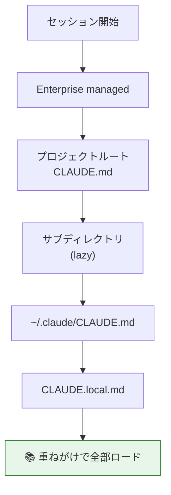

優先順位は Enterprise → プロジェクトルート → サブディレクトリ(lazy)→ `~/.claude/CLAUDE.md` → `CLAUDE.local.md` の順で重ねがけされます。HumanLayer 調査によれば **LLM の指示遵守は 150〜200 個程度が限界** のため、本体は **200 行以下** にし、`@docs/architecture.md` のような import 構文で組織化するのがベストプラクティスです。コードスタイルは linter / formatter / hook に任せ、CLAUDE.md には「動作ルール」だけ書きましょう。

ユーザーの要件「動作優先・デザイン後回し」「解決困難は後回し」「自動コミット」を行動原則化した CLAUDE.md テンプレートは以下の通りです。

```markdown
# プロジェクト: <NAME>

## アーキテクチャ概要
- 言語:TypeScript(厳格)/ Next.js 15 / Vitest + Playwright
- 詳細は @docs/architecture.md

## 開発フロー(必ず守る)
1. 変更前に `git switch -c feat/<topic>` でブランチ作成
2. **動作優先・デザイン後回し**:UI は最低限の見た目で先に動かす。
   美化や色調整は最後にまとめて行う
3. 機能を実装したら必ず:
   a. `npm run typecheck` を通す
   b. `npm test` を通す
   c. UI 機能なら verify-in-browser スキルで Playwright 検証
4. 全グリーンになったら **自動コミット**:
   `git add -p` で関連変更のみステージ → Conventional Commits でコミット
5. 1 機能完了ごとに push し、`gh pr create --fill` で PR 作成

## 解決困難な課題のハンドリング
- 同じテストが **3 回連続で失敗** したら、修正を諦めて以下を行う:
  1. `TODO.md` に「⚠️ Blocked: <問題> / <ファイル:行> / <最後のエラー>」を追記
  2. 該当箇所に `// TODO(claude): blocked - see TODO.md` コメントを残す
  3. **次のタスクに進む**(ループを止めない)
- 不確実な API 仕様は Context7 MCP で確認してから実装

## Retry Policy
- 問題発生時は自動で**最大 5 回**まで再試行
- 完了報告時に「failing tests / compile errors / unresolved errors」が
  残っていた場合は完了報告禁止

## 禁止事項
- `git add -A` 禁止(必ず `git add <file>` か `git add -p`)
- `.env*`、`secrets/`、`*.pem` のコミット禁止
- `any`、`as`、`@ts-ignore` の使用禁止
- 既存テストの削除禁止(壊れたら原因を直す)

## 関連ドキュメント
- @TODO.md(現在の作業キュー)
- @docs/architecture.md
```

### Skills の progressive disclosure

**Skills**(2025 年 10 月発表)は `.claude/skills/<name>/SKILL.md` に YAML frontmatter で定義する「専門知識パック」で、**progressive disclosure** によりコンテキストを圧迫しません。

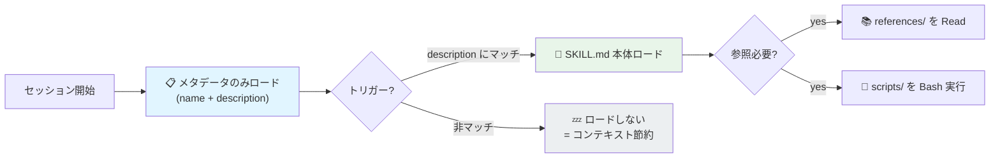

description は「ユーザーが◯◯と言ったら必ずこのスキルを使え」と **やや押し気味** に書くのが Anthropic 推奨です。コミット用、テスト実行用、ブラウザ検証用の 3 つを最低限揃えると無人ループが回ります。

```markdown
---
name: verify-in-browser
description: >
  実装した UI 機能を Playwright MCP で実際にブラウザで開き、
  期待通りに表示・動作するか確認する。フロントエンド機能の
  実装完了直後、PR 作成前に必ず使用。
allowed-tools: mcp__playwright__*, Read, Bash
---
## 手順
1. `npm run dev` をバックグラウンド起動(ポート確認)
2. `browser_navigate` で localhost:<port> を開く
3. `browser_snapshot` でアクセシビリティツリー取得
4. 実装した UI フロー(クリック・入力・遷移)を実行
5. 期待 DOM/テキストの存在を検証
6. 失敗したら debugger サブエージェントへ委譲
7. 成功なら "✅ Verified in browser: <flow>" を返す
```

### Subagents で並列分業

**Subagents**(`.claude/agents/<name>.md`)は独立コンテキスト・独立ツール権限・独立モデルを持つ専門エージェントで、親には **最終要約だけ** 返るためメインのコンテキストが汚染されません。

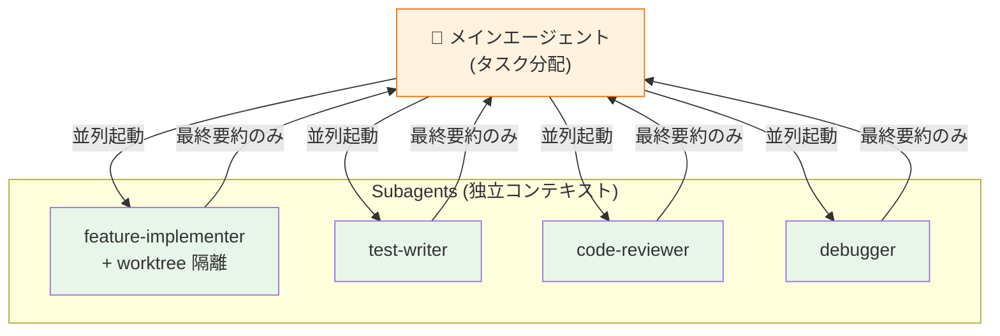

クラスメソッドの検証では「アーキテクチャ調査 / テストカバレッジ調査 / 依存関係調査」を 3 並列起動して 53 回のツール呼び出しを 2 分で完了しています。**3〜7 個に絞る** のが推奨で、`feature-implementer`(実装)/ `test-writer`(テスト)/ `code-reviewer`(レビュー)/ `debugger`(デバッグ)の 4 構成が標準です。`isolation: worktree` を frontmatter に書けば各サブエージェントが独立 worktree で動き、並列編集時のコンフリクトを物理的に防げます。

---

## MCP サーバー 7 点セットで「ブラウザで動かして検証」まで自動化

MCP(Model Context Protocol)は 2024 年 11 月発表のオープンプロトコルで、`claude mcp add` または `.mcp.json` で接続します。**ルート直下の `.mcp.json` に置く** こと(`.claude/.mcp.json` だと一部サーバが読み込まれない既知不具合あり、Issue #5037)。

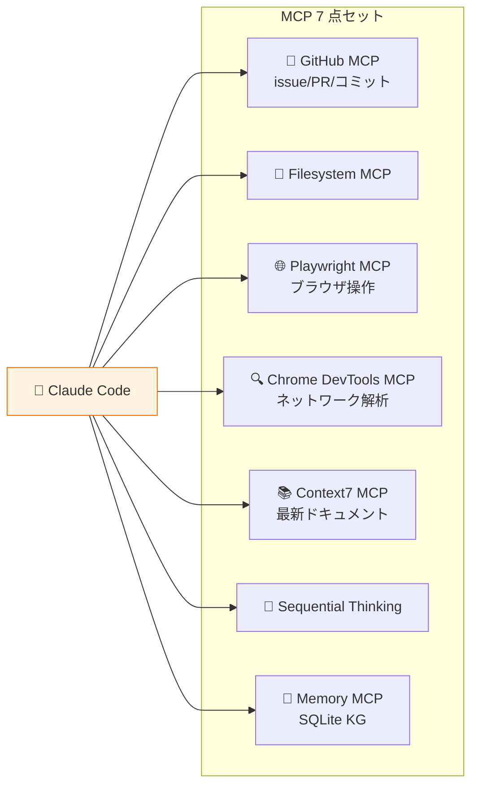

無人開発に効く 7 点セットは **GitHub MCP**(公式の `api.githubcopilot.com/mcp`、issue/PR/コミット)、**Filesystem MCP**、**Playwright MCP**(Microsoft 公式、`browser_navigate`/`browser_snapshot`/`browser_run_code`)、**Chrome DevTools MCP**(Google 公式、ネットワーク解析)、**Context7 MCP**(Upstash、ライブラリ最新ドキュメント取得)、**Sequential Thinking MCP**、**Memory MCP**(SQLite Knowledge Graph)です。

> ⚠️ **注意:`@modelcontextprotocol/server-github` npm 版は 2025 年 4 月に deprecated** になりました。現行は GitHub 公式の Docker / HTTP 版を使ってください。

```json
{
  "mcpServers": {
    "github": {
      "type": "http",
      "url": "https://api.githubcopilot.com/mcp",
      "headers": { "Authorization": "Bearer ${GITHUB_PAT}" }
    },
    "playwright": { "command": "npx", "args": ["@playwright/mcp@latest", "--browser=chromium"] },
    "chrome-devtools": { "command": "npx", "args": ["chrome-devtools-mcp@latest"] },
    "context7": { "command": "npx", "args": ["-y", "@upstash/context7-mcp@latest"] },
    "sequential-thinking": { "command": "npx", "args": ["-y", "@modelcontextprotocol/server-sequential-thinking"] },
    "memory": { "command": "npx", "args": ["-y", "@modelcontextprotocol/server-memory", "--memory-path", "${HOME}/.claude-memory"] }
  }
}
```

ブラウザ動作確認のワークフローは次の連鎖になります。

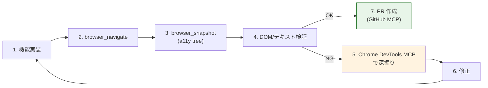

Microsoft の `playwright-cli install --skills` で Skill が自動配置され、`--codegen` オプションで TypeScript テストの自動生成までしてくれます。

---

## リミット待機+無限ループ:bash 3 種で「夜間放置」を実現

リミット到達の検知から再開までの実装は OSS が複数公開されています。`terryso/claude-auto-resume`(bash で `Claude usage limit reached` を grep → `date -d` で時刻パース → `sleep` → `--continue`)と `cheapestinference/claude-auto-retry`(npm、tmux capture-pane でポーリング、DST 対応)が代表格です。Anthropic 公式 issue(#36320, #35744, #18980)でも要望が多数集まっていますが、2026 年 4 月時点で公式機能としては未実装のため、自前で組みます。

「機能要件さえ書けば無人で動く」コア部分は、**TODO.md 駆動の無限ループ** で実装します。Geoffrey Huntley が提唱した **Ralph Wiggum ループ**([note @jujunjun110](https://note.com/jujunjun110/n/n0903bad8b2f2) 日本語解説、`jujunjun110/claude-looper`)の思想は「LLM の記憶を信じない、ファイルに状態を書き続ける」です。各イテレーションは **フレッシュコンテキスト** で開始し、知識永続化は Git 履歴 + CLAUDE.md + TODO.md で行います。これによりコンテキスト圧迫(context rot)が起きず、根気で機能を完成させられます。

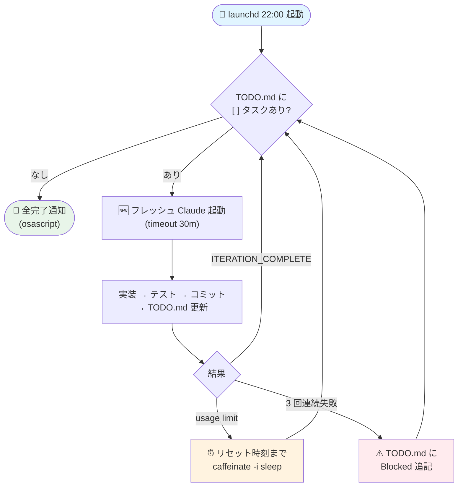

無人ループのコア実装(macOS BSD `date` と Linux GNU `date` 両対応、`caffeinate` でスリープ防止、リミットメッセージから時刻パース、エクスポネンシャルバックオフ、osascript 通知付き)は次の通りです。

```bash
#!/usr/bin/env bash
# claude-loop.sh - TODO.md を順次消化する無限ループ
set -uo pipefail
REPO="$(pwd)"; TODO="${REPO}/TODO.md"
LOG_DIR="${REPO}/.claude-loop"; mkdir -p "$LOG_DIR"
ITER=0; MAX_ITER="${MAX_ITER:-50}"; RETRY_BASE_SLEEP=60

while (( ITER < MAX_ITER )); do
  ITER=$((ITER + 1)); TS=$(date +%Y%m%d_%H%M%S)
  LOG="$LOG_DIR/iter_${ITER}_${TS}.log"
  echo "===== Iteration ${ITER} ===== $(date)" | tee "$LOG"

  # ① 未完了タスク確認
  if ! grep -qE '^\s*-\s*\[\s*\]' "$TODO" 2>/dev/null; then
    osascript -e 'display notification "ALL DONE 🎉" with title "Claude Loop"' 2>/dev/null
    break
  fi

  PROMPT=$(cat <<'EOF'
TODO.md の最上位 [ ] タスクを 1 つ選び順に実行:
1. 機能要件の確認・実装計画
2. 必要ファイルの実装
3. テスト作成と実行(5 回失敗で停止)
4. lint/typecheck をパス
5. git add -p && git commit -m "feat: ..."
6. TODO.md の該当項目を [x] に更新して commit
完了で "ITERATION_COMPLETE"、失敗で "ITERATION_FAILED: <reason>" を最終行に出力。
3 回連続テスト失敗のタスクは TODO.md に "⚠️ Blocked" を追加し次へ。
EOF
)
  timeout 30m claude -p "$PROMPT" \
    --dangerously-skip-permissions \
    --permission-mode acceptEdits \
    --output-format text 2>&1 | tee -a "$LOG"
  EC=${PIPESTATUS[0]}

  # ② リミット検知 → 正確な時刻まで wait
  if grep -qiE "usage limit reached" "$LOG"; then
    reset=$(grep -oE 'reset at [0-9]+(am|pm)' "$LOG" | tail -1 | awk '{print $3}')
    tz=$(grep -oE '\([A-Za-z_/]+\)' "$LOG" | tail -1 | tr -d '()')
    target=$(TZ="$tz" date -j -f '%I%p %Y-%m-%d' "$reset $(date +%Y-%m-%d)" +%s 2>/dev/null \
             || date -d "today $reset" +%s 2>/dev/null \
             || echo $(( $(date +%s) + 1800 )))
    now=$(date +%s); (( target <= now )) && target=$((target + 86400))
    sleep_for=$(( target - now + 60 ))
    osascript -e "display notification \"Resuming in $((sleep_for/60))m\" with title \"Claude Loop\"" 2>/dev/null
    caffeinate -i sleep "$sleep_for"
    continue
  fi

  # ③ 通常エラーはエクスポネンシャルバックオフ
  if (( EC != 0 )) || ! grep -q "ITERATION_COMPLETE" "$LOG"; then
    backoff=$(( RETRY_BASE_SLEEP * (2 ** (ITER % 5)) ))
    sleep "$backoff"
  fi
done
```

tmux で「夜間放置」する場合は `tmux new-session -d -s claude-loop "caffeinate -i ./claude-loop.sh > .claude-loop/run.log 2>&1"` で起動し、`tmux attach -t claude-loop` で監視、`Ctrl+b d` でデタッチします。OS 再起動後の自動復元には **tmux-resurrect + tmux-continuum**、Claude 専用なら **mikedyan/tmux-claude-resurrect** を組み合わせます。

---

## Mac 固有の自動化:launchd + caffeinate + 4 つの壁突破

`caffeinate -i` でアイドルスリープ防止、`-d` でディスプレイ、`-s` で AC 電源時の system sleep、`-t 28800` で時間限定が可能です。実は **Claude Code 自身が内部で `caffeinate -i -t 300` を 5 分ごとに spawn する** ため対話実行中はそもそもスリープしませんが(Issue #21432)、**バックエンド / cron / launchd から spawn する場合は明示的に `caffeinate` でラップする** のが安全です。ラップトップを閉じた瞬間も caffeinate は効きません。

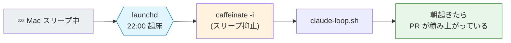

GMO ペパボの記事([zenn.dev/pepabo](https://zenn.dev/pepabo/articles/claude-code-cron-autonomous-ui-walls))が指摘する **cron 自走で毎回ハマる 4 つの壁** を整理しました。

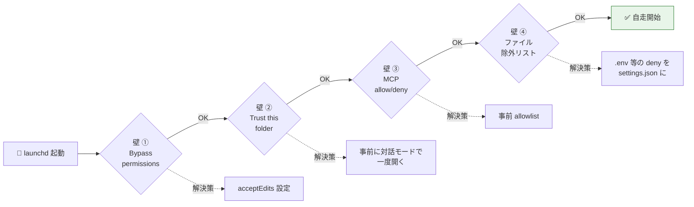

| 壁                   | 内容                    | 解決策                                                                             |
| -------------------- | ----------------------- | ---------------------------------------------------------------------------------- |
| ① Bypass permissions | 権限プロンプトで止まる  | `--permission-mode acceptEdits`                                                    |
| ② Trust this folder  | 初回起動で信頼確認      | 対話モードで一度開く / `~/.claude.json` の `hasTrustDialogAccepted: true` を直書き |
| ③ MCP の allow/deny  | MCP ツールで止まる      | 事前に対話モードで一度許可                                                         |
| ④ ファイル除外       | `.env` などへのアクセス | settings.json の deny に明記                                                       |

これらを抜ければ launchd で完全無人化できます。`~/Library/LaunchAgents/com.user.claude-loop.plist` を以下で配置します。

```xml
<?xml version="1.0" encoding="UTF-8"?>
<plist version="1.0"><dict>
  <key>Label</key><string>com.user.claude-loop</string>
  <key>ProgramArguments</key><array>
    <string>/usr/bin/caffeinate</string><string>-i</string>
    <string>/bin/bash</string><string>-lc</string>
    <string>cd /Users/me/projects/myapp && /usr/local/bin/claude-loop.sh</string>
  </array>
  <key>StartCalendarInterval</key>
    <dict><key>Hour</key><integer>22</integer><key>Minute</key><integer>0</integer></dict>
  <key>EnvironmentVariables</key>
    <dict><key>PATH</key><string>/opt/homebrew/bin:/usr/local/bin:/usr/bin:/bin</string></dict>
  <key>StandardOutPath</key><string>/Users/me/.claude-loop/stdout.log</string>
  <key>StandardErrorPath</key><string>/Users/me/.claude-loop/stderr.log</string>
  <key>WorkingDirectory</key><string>/Users/me/projects/myapp</string>
</dict></plist>
```

`launchctl load ~/Library/LaunchAgents/com.user.claude-loop.plist` でロードし、`launchctl start com.user.claude-loop` で即時実行できます。**cron は寝てる Mac では発火しない** ため `pmset repeat wake MTWRF 02:55:00` の事前起床と組み合わせるか、**launchd 一択** です。完了通知は `osascript -e 'display notification "Iteration 5 完了" with title "Claude Loop" sound name "Glass"'` でロックスクリーンに送れます。`fswatch -o src/ tests/ | xargs -n1 -I{} claude -p "..."` のファイル監視併用も有効で、保存と同時にテスト / 修復ループが走ります。

---

## 究極のセットアップ:4 フェーズで「機能要件 1 行 → PR 作成」

ディレクトリ構成は次のように `.claude/` 配下に **全制御ファイルを集約** します。

```
~/projects/myapp/
├── CLAUDE.md                     # 200 行以下、行動原則
├── TODO.md                       # 作業キュー([ ]/[x]/⚠️)
├── .mcp.json                     # 7 点セット MCP
├── .claude/
│   ├── settings.json             # 権限・hooks
│   ├── skills/
│   │   ├── commit/SKILL.md       # Conventional Commits 自動生成
│   │   ├── run-tests-and-fix/SKILL.md
│   │   └── verify-in-browser/SKILL.md  # Playwright 検証
│   ├── agents/
│   │   ├── feature-implementer.md  # model: sonnet, isolation: worktree
│   │   ├── test-writer.md
│   │   ├── code-reviewer.md
│   │   └── debugger.md
│   └── hooks/
│       ├── block-dangerous.sh
│       └── format-and-lint.sh
└── specs/<feature>/{requirements,design,tasks}.md   # cc-sdd の SDD
```

運用は次の 4 フェーズで進めます。

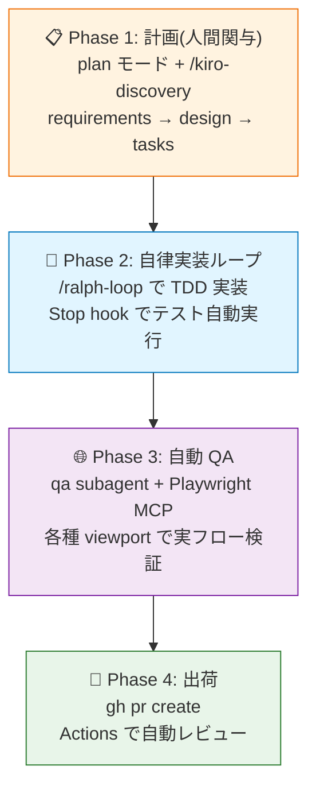

**Phase 1(計画、人間関与)** で `claude --permission-mode plan` を起動し `/kiro-discovery` で機能要件を `requirements.md`(EARS 記法)→ `design.md` → `tasks.md` に分解、人間が approve します(cc-sdd プラグイン、`gotalab/cc-sdd`)。**Phase 2(自律実装ループ)** で `claude -w feature-x` から `/ralph-loop "Implement specs/feature-x/tasks.md..."` を起動、Sonnet 4.6 がフレッシュコンテキストで各タスクを TDD で実装、Stop hook で `pnpm test` 自動実行、緑になったら次タスクへ。**Phase 3(自動 QA)** では `qa` subagent が Playwright MCP で 375×667 モバイル含む各種 viewport で実フロー検証、失敗時はデバッガに自動委譲します。**Phase 4(出荷)** で `gh pr create` し、GitHub Actions の `anthropics/claude-code-action@v1` が PR レビューを自動コメントします。

「機能要件 1 行 → 無人で機能完成」の最小コマンドは次の通りです。

```bash
echo "ユーザーが商品にレビューを書いて星評価できる機能" > /tmp/req.txt
caffeinate -i tmux new -d -s claude-loop \
  "claude --dangerously-skip-permissions --permission-mode acceptEdits \
   -p \"$(cat /tmp/req.txt)
   以下を順に実行:
   1) /kiro-discovery → spec 生成
   2) Plan Mode で計画提示後、自動 approve
   3) /ralph-loop で実装ループ開始(max 30 iteration)
   4) Playwright MCP で E2E 検証
   5) gh pr create で PR 作成\""
```

**Pro プランで 24 時間化する経済的レシピ** は、ローカル launchd で毎晩 22:00 に `claude-loop.sh` を起動し(`/loop` はセッション終了で消えるため永続用途には不適)、`ccusage statusline` で残量常時表示、リミット到達時は bash でリセット時刻まで `caffeinate -i sleep` するというものです。Routines(クラウド)は Pro で 5 回 / 日と少ないため、`@claude` の PR コメント自動レビュー専用に使い、メイン開発はローカルで回しましょう。Pro 上限が頻繁にぶつかるようなら **Max 5x($100)か `musistudio/claude-code-router` で Sonnet を OpenRouter 経由 API にスワップ** する運用が現実解です。

---

## 隔離戦略:DevContainer + Worktree + Checkpointing が三種の神器

`--dangerously-skip-permissions` を実機で直に使うのはプロンプトインジェクションと破壊コマンドのリスクが高いです。

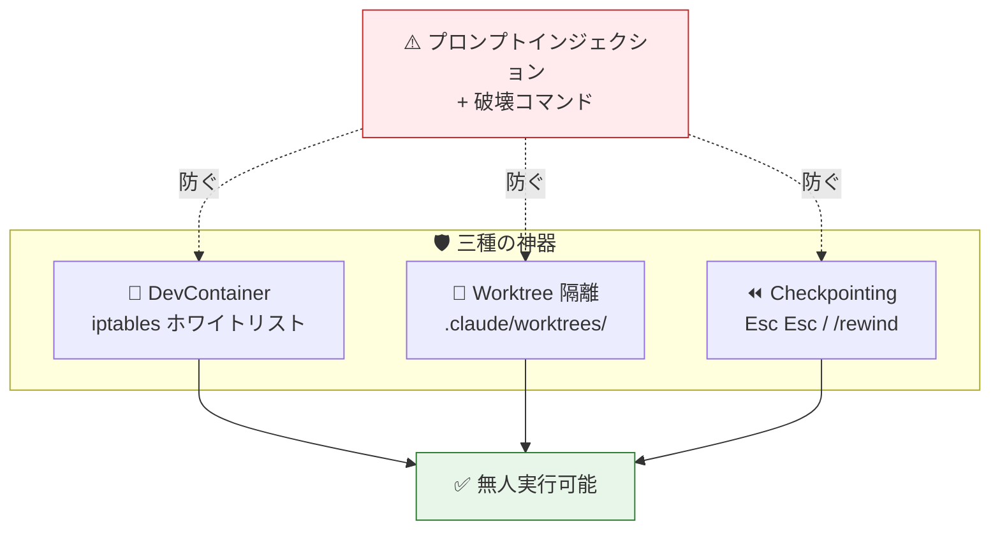

Anthropic 公式 DevContainer(`anthropics/claude-code/.devcontainer`)は 3 ファイル構成(`devcontainer.json`/`Dockerfile`/`init-firewall.sh`)で、iptables + ipset によるホワイトリスト型ファイアウォールを `node` ユーザー sudoers で設定し、`api.anthropic.com`/`registry.npmjs.org`/`api.github.com` 等のみ outbound 許可、それ以外 deny します。Anthropic は「コンテナのセキュリティ強化により安全に無人実行できる」と明記していますが、「Claude Code credential が漏洩しうるので **信頼できるリポジトリでのみ使え**」と注意しています。スタンドアロンで動かすなら `docker run --cap-drop=ALL --cap-add=NET_ADMIN --cap-add=NET_RAW -v $(pwd):/workspaces/project claude-code-sandbox` が定石で、`~/.ssh` `~/.aws` は絶対にマウントしないでください。

`--worktree` (`-w`) ネイティブサポートは v2.1.49–50 で CLI 統合され、`<repo>/.claude/worktrees/<name>/` に隔離 worktree を作成します。Subagent frontmatter の `isolation: worktree` で各サブエージェントを独立 worktree に閉じ込められ、並列実行時の同一ファイル編集競合を物理的に防げます。Boris Cherny 自身は **同時 10〜15 体** の Claude を回しています。Checkpointing(Claude Code 2.0)は各編集前に自動スナップショットし `Esc Esc` または `/rewind` で巻き戻せますが、**Claude のファイル編集ツールが行った変更のみ** が対象で手動編集や bash 経由の変更は含まれません──必ず Git と併用してください。`--max-turns 50` と `--max-budget-usd 5.00` で物理的上限も設定し、`PreToolUse` hook で `rm -rf|sudo|:(){:|:&};:|dd if=|mkfs` を正規表現で deny するスクリプトを必ず登録するようにしましょう。

---

## 結論:Pro でも実装可能、ボトルネックは「人間の要件記述」だけ

2026 年 4 月時点で「機能要件さえ書けば Claude Code が無人で開発を進める」セットアップは Pro プランでも完全に実装可能です。鍵は次の 5 つです。

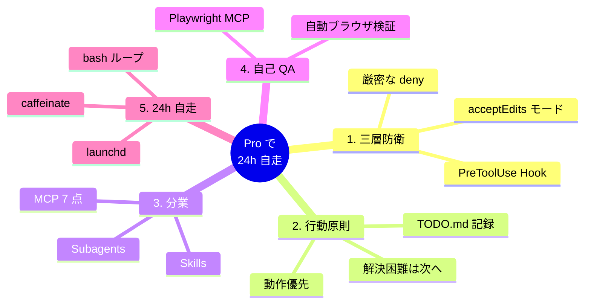

- **(1) `acceptEdits` モード + 厳密な deny + PreToolUse hook の三層防衛** で危険操作を物理ブロックする
- **(2) CLAUDE.md に「動作優先・解決困難は TODO.md に⚠️で記録して次へ」を行動原則化** する
- **(3) Skills と Subagents で実装 / テスト / レビュー / QA を分業** する
- **(4) Playwright MCP で自己 QA** まで閉じさせる
- **(5) bash の TODO.md ループ + `caffeinate` + リミット時刻パース + launchd で 24 時間自走させる**

Ralph Wiggum ループ思想で「フレッシュコンテキスト × Git 永続化」を徹底すれば、context rot で破綻せず根気で機能を完成させられます。

留意点として、Claude Code は週次で急速にアップデートしており、`auto` モード、Agent Teams(2026/2 実験的)、Routines(2026/4)、Opus 4.7(SubAgent 委譲がより慎重に)など 2026 年に入って自律性の階梯が一段上がりました。Pro での Routines 5 回 / 日制限は重要トリガー(PR review など)に絞り、メインのループはローカル launchd で安く長く回すのが経済合理的です。

最後に注意したいのは **`/model sonnet` 明示で週次 Opus 上限ブロックを回避** する点と、**Cache Read がトークン消費の主犯** である点で、`ccusage daily --breakdown` で月初に内訳を確認する習慣をつけたいところです。残るボトルネックは Claude ではなく **人間が書く機能要件の質** だけで、それを SDD の `requirements.md` に EARS 記法で書ければ──あとは寝ている間に PR が積み上がっています。

---

### 関連

- 実行可能ベストプラクティス版:[[2026-04-28_Claude Code Pro 自律稼働 実行可能ベストプラクティス.md]]
