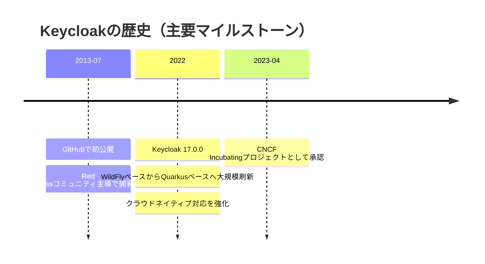

## 基本情報

```txt
Keycloak（キークローク）は、Webベースのシステムに認証と認可の機能を組み込むOSS（オープンソースソフトウェア）です。セキュリティ事件が相次ぐ今、認証・認可は必須技術です。「第２版」は、WildFlyからQuarkusへ刷新されたオープンソースのセキュリティの仕組み「Keycloak（キークローク）」の新アーキテクチャを詳解する日本初の書籍です。 本書では、豊富な機能を備えるKeycloakについて、前提となる認証と認可の仕組みを基礎から解説し、典型的なユースケースの実現方法や本番システムへの実装方法まで詳しく解説しました。前提知識の部分も説明が少なかったログアウト等も補足しました。 最新技術に対応した実践的な内容で、ソフトウェア技術者必読の一冊です！
```

## 目次

### 入門編

基礎知識を習得しよう

- 第1章 Keycloakを理解するための第一歩
  - 1.1 認証と認可およびKeycloakの概要
  - 1.2 Keycloakの動作要件とディレクトリー構成
  - 1.3 Keycloakのセットアップと動作確認
  - 1.4 本章のまとめ
- 第2章 OAuthとOIDCの基礎知識
  - 2.1 OAuthのフロー
  - 2.2 アクセストークンとリフレッシュトークン
  - 2.3 トークンの無効化と認可判断
  - 2.4 OIDCのフロー
  - 2.5 本章のまとめ
- 第3章 SSOの基礎知識
  - 3.1 SSOを理解する
  - 3.2 標準プロトコルによるSSO
  - 3.3 本章のまとめ
- 第4章 Keycloakの基礎を理解する
  - 4.1 Keycloakの用語解説
  - 4.2 セッションとトークンの設定
  - 4.3 Keycloakの情報源
  - 4.4 本章のまとめ

---

- 認証認可について
  - Authenticationを略して、AuthN
  - Authorizationを略して、AuthZ
  - と呼ばれることがあるらしい

- KeyCloakは IAM(Identity and Access Management) のソフトウェア
  - IAM: 適切な人やマシンが適切なリソースに適切な理由のため適切なタイミングでアクセスできるようにするもの
    - *ガートナー社定義
  - IAMの中でも、「認証と認可」を担っている
  - IAMで認証・認可以外に重要な機能
    - IDライフサイクル管理: 入社/異動/退職に合わせてアカウントと権限を自動で付与・変更・剥奪する（JML: Joiner/Mover/Leaver）
    - ユーザー/組織情報の統合: 人事DBやディレクトリ（LDAP/AD）と連携し、ID情報を一元管理する
    - 特権アクセス管理（PAM）: 管理者アカウントの利用を最小化し、払い出し・記録・承認を厳格化する
    - 監査ログと追跡性: 「誰が・いつ・どの権限で・何をしたか」を証跡として残し、監査に対応する
    - セルフサービスと運用効率化: パスワードリセット、アクセス申請、承認フローをユーザー主導で回せるようにする
  - IAMで押さえるべき実務ポイント
    - 最小権限の原則: 初期権限は必要最小限にし、ロール設計は職務ベース（RBAC）を基本にする
    - 権限の定期レビュー: 付与しっぱなしを防ぐため、棚卸し（アクセスレビュー）を定期実施する
    - 職務分掌（SoD）違反の防止: 申請と承認を同一人物に集中させないなど、統制ルールを設ける
    - 可用性と災害対策: IAM停止が業務停止に直結するため、冗長化・バックアップ・復旧手順を準備する
    - 法令/規制対応: 個人情報保護や各種ガイドラインに合わせ、保持期間やマスキング方針を明確化する

#### KeyCloakの中のIAM機能

| 区分                          | KeyCloakでできること                                                                     | 代表的な機能例                                        |
| ----------------------------- | ---------------------------------------------------------------------------------------- | ----------------------------------------------------- |
| ID管理（Identity Management） | ユーザー、グループ、ロール、属性の管理。LDAP/Active Directory連携。                      | ユーザー属性管理、グループベース割当、LDAP Federation |
| 認証（Authentication）        | ログイン/ログアウト、セッション管理、MFA、パスワードポリシー、認証フローのカスタマイズ。 | Browser Flow、OTP、条件付き認証                       |
| 認可（Authorization）         | RBAC、クライアントスコープ、ポリシーベース認可。                                         | Authorization Services（Resource/Scope/Policy）       |
| フェデレーションとSSO         | OIDC/SAMLによるSSO、外部IdP連携、SLO。                                                   | Identity Brokering、Google/Azure AD連携               |
| トークンとセッション制御      | Access/Refresh/IDトークンの発行・更新・失効、有効期限設定。                              | Token Lifespan設定、Revocation、Offline Session       |
| 監査・運用管理                | 認証イベント/管理イベントログ、管理コンソール、Admin API、Realm分離。                    | Event Logs、Admin REST API、マルチRealm運用           |

#### KeyCloakの守備範囲外（または単体では不足しやすい）IAM機能

| 機能領域                           | 概要                                                         | KeyCloak単体での扱い                                       | 代表的な製品/サービス例                                  |
| ---------------------------------- | ------------------------------------------------------------ | ---------------------------------------------------------- | -------------------------------------------------------- |
| 特権アクセス管理（PAM）            | 管理者IDの貸与、記録、セッション統制、緊急アクセス管理。     | 直接の中核機能は弱い。外部PAM連携が一般的。                | CyberArk、BeyondTrust、Delinea、HashiCorp Boundary       |
| IGA（IDガバナンス/ライフサイクル） | 入社/異動/退職（JML）、申請承認、アクセスレビュー、SoD統制。 | ワークフロー/統制機能は限定的。外部IGAが必要になりやすい。 | SailPoint、Saviynt、Omada、Microsoft Entra ID Governance |
| 権限申請・承認ワークフロー         | 業務ロール申請、上長承認、期限付き付与、自動剥奪。           | 標準で本格的な承認ワークフローは薄い。                     | ServiceNow、SailPoint、Saviynt                           |
| SIEM/SOC連携による高度監視         | 横断ログ分析、相関検知、脅威ハンティング、インシデント対応。 | イベント出力は可能だが、分析基盤は別途必要。               | Splunk、Microsoft Sentinel、Elastic Security、IBM QRadar |
| 非人間ID（Workload/Secrets）管理   | サービスアカウント、マシンID、秘密情報ローテーション。       | 一部対応は可能だが、Secrets管理は専用製品が適する。        | HashiCorp Vault、AWS Secrets Manager、Azure Key Vault    |
| ゼロトラスト文脈制御（ZTNA）       | 端末状態・ネットワーク文脈を加味したアクセス制御。           | 認証基盤としては連携可能だが、ZTNA自体は範囲外。           | Zscaler、Cloudflare Zero Trust、Netskope                 |

#### KeyCloakアーキテクチャの変換点



#### Web情報ベースで追加で押さえるポイント

| 観点                 | 押さえるポイント                                                                           | 実務でのアクション                                                         |
| -------------------- | ------------------------------------------------------------------------------------------ | -------------------------------------------------------------------------- |
| 最新リリース追従     | Keycloakは継続的にリリースされ、セキュリティ修正（CVE対応）が頻繁に入る。                  | 四半期ごとにリリースノートを確認し、計画的にアップデートする。             |
| Quarkus前提の運用    | Keycloak 17以降はQuarkusディストリビューションが前提。WildFly時代と設定/運用手順が異なる。 | 新規構築はQuarkus前提で設計し、移行時は公式Migrationガイドを必ず確認する。 |
| Kubernetes運用       | Keycloak OperatorでKubernetes/OpenShift運用が可能。                                        | Operator導入時はCRDベース運用を採用し、設定は宣言的に管理する。            |
| アップグレード統制   | Operatorの自動更新は意図しないバージョン更新やDBマイグレーションを招く可能性がある。       | 本番は手動承認で更新し、事前にステージングでマイグレーション検証を行う。   |
| CNCFエコシステム連携 | CNCF Incubatingとして、クラウドネイティブ運用との親和性が高い。                            | 監視（Prometheus）、トレース、GitOpsなど周辺基盤との統合を前提に構成する。 |

### Quarkusについて

Quarkusは、コンテナー/Kubernetes環境を前提に最適化されたJavaフレームワーク。
特に「起動の速さ」「省メモリ」「運用しやすさ」を重視しており、クラウドネイティブなJava実行基盤として採用が進んでいる。
Keycloakもバージョン17以降でQuarkusベースに移行し、従来のWildFlyベースより軽量で予測可能な運用がしやすくなった。

- Quarkusの主な特徴
  - 高速起動: 開発時のホットリロードと本番時の短時間起動
  - 省メモリ: コンテナー密度を上げやすい
  - Kubernetes親和性: 設定・ヘルスチェック・メトリクス連携がしやすい
  - JVMモード/Native Imageモード: 要件に応じて実行形態を選択可能

#### Javaフレームワーク比較（歴代含む）

| フレームワーク/世代          | 主な時代感         | 強み                                                     | 注意点・向いている用途                                                                             |
| ---------------------------- | ------------------ | -------------------------------------------------------- | -------------------------------------------------------------------------------------------------- |
| Java EE / Jakarta EE（仕様） | 2000年代〜現在     | エンタープライズ標準、仕様ベースで移植性が高い           | 実装製品への理解が必要。大規模業務システム向け                                                     |
| WildFly                      | 2013年〜現在       | Java EE/Jakarta EE準拠の実装。高い拡張性と豊富な運用機能 | 設定や運用が複雑になりやすい。従来型/大規模システム向き。最新のクラウドネイティブ用途はQuarkus推奨 |
| Struts（1/2）                | 2000年代前半〜中盤 | 当時のMVC Web開発を普及                                  | 現代的な開発体験や保守性で不利。新規採用は限定的                                                   |
| Spring Framework（MVC中心）  | 2000年代中盤〜     | DI/AOPで柔軟、エコシステムが巨大                         | 設定自由度が高く設計ルールがないと複雑化しやすい                                                   |
| Play Framework               | 2010年代〜         | 非同期I/O、軽快なWeb開発体験                             | 採用母数はSpring系より小さい                                                                       |
| Dropwizard                   | 2010年代〜         | シンプルなREST API構築、運用部品がまとまっている         | 機能拡張の幅はSpring Bootより狭め                                                                  |
| Micronaut                    | 2018年〜           | 低メモリ・高速起動、DIをコンパイル時に解決               | 周辺エコシステムはSpringより小さめ                                                                 |
| Helidon（SE/MP）             | 2018年〜           | MicroProfile対応、軽量マイクロサービス向け               | 採用事例は限定的で情報量が少なめ                                                                   |
| Spring Boot                  | 2014年〜現在       | 実績・情報量・ライブラリ連携が非常に豊富                 | デフォルト運用でメモリ消費が大きくなりやすい                                                       |
| Quarkus                      | 2019年〜現在       | 起動速度・省メモリ・Kubernetes親和性、Native Image対応   | Native化時は制約確認が必要。クラウドネイティブ用途に強い                                           |

> 補足: 実務では「既存資産の多さならSpring Boot」「軽量・高速起動重視ならQuarkus/Micronaut」を軸に比較するケースが多い。

### トークン検証について

- 以下の２通りがある
  - ローカルでのトークン検証
    - `https://www.jwt.io/ja/libraries`に対応する言語とのライブラリーが紹介されている
  - トークンイントロスペクション

### admin-cli

- 各Realmには `admin-cli`クライアントが作成される
  - このクライアントを使ってKeyCloakのAdminRESTAPIを呼び出せる

### KeyCloakコミュニティー

- 公式な最新情報
  - KeyCloak公式Webサイトのブログ
    - <https://keycloak.org/blog>
  - KeyCloakのXアカウント
    - <https://x.com/keycloak>

- 質問をしたい
  - Slack
    - <https://slack.cncf.io/>
      - `keycloak`,`#keycloak-dev`チャネル
  - Discourse
    - <https://keycloak.discourse.group/>
  - GitHub Disscussions
    - <https://github.com/keycloak/keycloak/discussions>
  - メーリングリスト
    - ユーザー向け；<https://groups.google.com/g/keycloak.user/>
    - 開発者向け：<https://groups.google.com/g/keycloak.dev/>
      - Slackなどが出てきてあまり活発でなくなった

- これらについては公式ページにも案内あり、その時の最新は公式から取得する必要あり
  - Questions and help: <https://www.keycloak.org/community>

- バグ報告や機能追加リクエストをしたい
  - Issueを作成する

- コードやドキュメントの開発に貢献したい
  - Contributionガイドを確認しPullRequestを提出

- 最新の標準仕様の開発に携わりたい
  - <https://github.com/keycloak/keycloak-oauth-sig/tree/main>

- ユーザーや開発者と交流したい
  - <https://community.cncf.io/cloud-native-security-japan/>
  - <https://www.keycloak.org/community>

### 実践編

実際の3つのユースケースを題材に基本的な使い方と設定方法をマスターしよう

- 第5章 OAuthに従ったAPI認可の実現
  - 5.1 API認可を実現する環境の構築
  - 5.2 認可コードフローによるアクセストークン取得
  - 5.3 API呼び出し時の認可判断とスコープの設定
  - 5.4 トークンのリフレッシュと無効化
  - 5.5 OAuth/OIDCのセキュリティー確保
  - 5.6 API認可で重要なKeycloakの利用方法
  - 5.7 本章のまとめ
- 第6章 SSOを実現する
  - 6.1 本章で取り扱うユースケース
  - 6.2 Spring Securityを用いた認証連携
  - 6.3 リバースプロキシーを用いた認証連携
  - 6.4 JavaScriptアダプターを用いた認証連携
  - 6.5 SSOとSLOの動作確認
  - 6.6 その他のSSOの動向と概略
  - 6.7 本章のまとめ
- 第7章 さまざまな認証方式を用いる
  - 7.1 認証の強化
  - 7.2 外部ユーザーストレージによる認証
  - 7.3 外部アイデンティティープロバイダーによる認証
  - 7.4 本章のまとめ

#### 認証方式についての情報

- この部分についての公式ページ
  - <https://www.keycloak.org/docs/latest/server_admin/index.html>

- KeyCloakではOTPやパスキー認証が可能

- 認証フローの概要
  - Executionと呼ばれる個々の認証処理を組み合わせて構成
- 認証フロートその構成の考え方
  - 認証フロー要件（Requirement）の種類
    - **Required（必須）**
      - フロー内の `Required` 要素は、順番にすべて成功する必要がある
      - 必須要素のいずれかが失敗した時点で、そのフローは終了する
    - **Alternative（代替）**
      - フローが成功と判定されるには、`Alternative` 要素のうち1つが成功すればよい
      - ただし同じフロー内に `Required` 要素がある場合、`Required` だけで成功条件を満たすため、`Alternative` は実行されない
    - **Disabled（無効）**
      - その要素は、フロー成功判定の対象にならない
    - **Conditional（条件付き）**
      - この要件タイプはサブフローにのみ設定できる
      - `Conditional` サブフローには Execution を含めることができ、Execution は論理式として評価される
      - すべての Execution が `true` の場合、`Conditional` サブフローは `Required` として動作する
      - いずれかの Execution が `false` の場合、`Conditional` サブフローは `Disabled` として動作する
      - Execution を設定しない場合、`Conditional` サブフローは `Disabled` として扱われる
      - フローに Execution が含まれていても、フロー自体が `Conditional` に設定されていない場合、Keycloak は Execution を評価せず、機能的には `Disabled` と同様に扱う

- acr（認証コンテキストクラスリファレンス）クレームを用いたステップアップ認証
  - **概要**
    - `acr` は「どの強度で認証したか」を示すクレーム
    - ステップアップ認証は、通常操作では低い認証強度、重要操作では高い認証強度を要求する考え方
    - これにより、UXを保ちながら高リスク操作だけを強固に守れる
  - **よくある利用シーン**
    - 閲覧系画面: パスワードログインのみで許可
    - 振込・個人情報変更・管理者操作: OTPやパスキーの追加認証を要求
  - **具体例（ECサイトの支払い情報変更）**
    - 1. ユーザーが通常ログイン（例: `acr=low`）
    - 1. 商品閲覧やカート操作はそのまま許可
    - 1. 「クレジットカード変更」画面に遷移したとき、アプリ側で高い `acr`（例: `acr=high`）を要求
    - 1. Keycloak がOTP入力を要求し、成功後に `acr=high` のトークンを再発行
    - 1. アプリは `acr=high` を確認して、支払い情報変更を許可
  - **実装時のポイント**
    - アプリ側で「どの操作にどの `acr` が必要か」を明確に定義する
    - API側でも `acr` を検証し、フロントだけに依存しない
    - `acr` の値設計（`low` / `medium` / `high` など）は運用ルールと合わせて統一する
  - <https://www.keycloak.org/docs/latest/server_admin/index.html#_step-up-flow>

### 応用編

実システム利用を見据えた使い方を知ろう

- 第8章 Keycloakのカスタマイズ
  - 8.1 カスタマイズの可能な箇所と仕組み
  - 8.2 画面のカスタマイズ
  - 8.3 SPIの新規プロバイダーの開発
  - 8.4 Keycloakのビルド
  - 8.5 カスタムコンテナーイメージの作成
  - 8.6 本章のまとめ
- 第9章 Keycloakの非機能面の考慮ポイント
  - 9.1 HA構成
  - 9.2 HTTPSの設定
  - 9.3 エンドポイントの設定
  - 9.4 可観測性（Observability）
  - 9.5 アップグレード
  - 9.6 本章のまとめ
