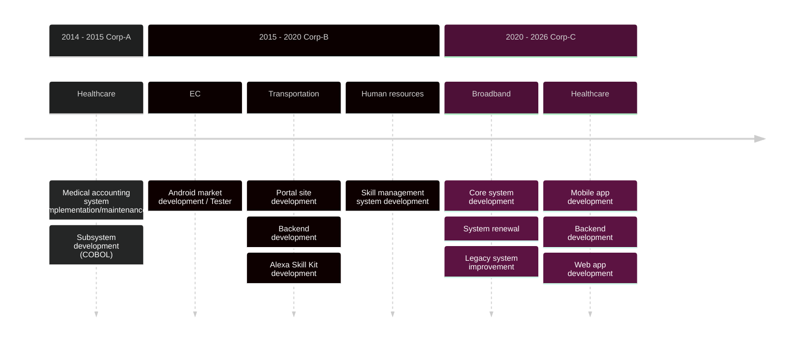

<h1>Hi, I'm Tomoaki Tsutsui</h1>

  

    

<!--
**tutttuwi/tutttuwi** is a ✨ _special_ ✨ repository because its `README.md` (this file) appears on your GitHub profile.

Here are some ideas to get you started:

- 🔭 I’m currently working on ...
- 🌱 I’m currently learning ...
- 👯 I’m looking to collaborate on ...
- 🤔 I’m looking for help with ...
- 💬 Ask me about ...
- 📫 How to reach me: ...
- 😄 Pronouns: ...
- ⚡ Fun fact: ...
-->

<!--
[icon]
- use: <https://thuongtruong109.github.io/icoziv/>
- find here: <https://thuongtruong109.github.io/icoziv/>
-->

### 🛠 &nbsp;Tech Stack

#### Frontend

  

#### Backend

  

#### ☁️ Cloud & Database

  

#### Tools & Environments

  

#### Misc

  

### 💳 Github Profile Summary Card

    

### ⚙️ &nbsp;GitHub Stats

### ⭐️ &nbsp;GitHub Activity

  
  
### 🤝🏻 &nbsp;Connect with Me

 

### 🌈 Applications I developed

- [Chrome Extension](https://chromewebstore.google.com/detail/gcal-mine/pjamieabipajfibinbhpmgfpbpidlchk) - Gcal-Mine
- [Chrome Extension](https://chromewebstore.google.com/detail/tab-group-keeper/gfjhodpdmkiofmolchbmjlhinlileemd) - Tab Group Keeper
- [Chrome Extension](https://chromewebstore.google.com/detail/fastmemo/ikggcjldloflbjfafhhjpnbbjkpnphna) - Fast Memo
- [Chrome Extension](https://chromewebstore.google.com/detail/quickframer/emfekienjacgppfhiojogchdeoonhdlg) - Quick Framer
- [Utility](https://github.com/tutttuwi/dbdump) - dbdump
- [Application](https://github.com/tutttuwi/springboot-management-starter) - springboot-management-starter
- [Application](http://contents.ang-fnt-suumo.t-tsutsui.s3-website-ap-northeast-1.amazonaws.com/property-list) - SUUMO Bukken Hikaku
- [Application](https://github.com/tutttuwi/aggregateWordsOfLyric) - Analize Lyric Words App
- [iOS App](https://apps.apple.com/jp/app/id6748651351) - 医療情報技師対策道場
- [Android App](https://play.google.com/store/apps/details?id=com.tutttuwi.app.medinfotech) - 医療情報技師対策道場
- [iOS App](https://apps.apple.com/jp/app/id6747262236) - シンプル万歩計
- [Android App](https://play.google.com/store/apps/details?id=com.tutttuwi.app.simplepedometer) - シンプル万歩計

### Certification

please check [linkedin page](https://www.linkedin.com/in/tutttuwi/details/certifications/)

### Engineer Journey

